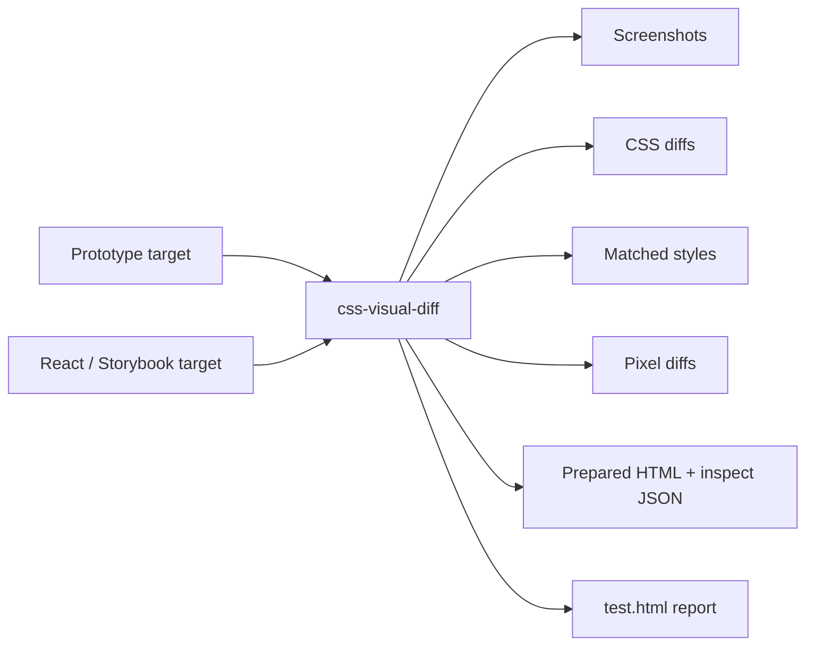

# Developer Handoff for Pyxis Visual Comparisons and Storybook Parity

This note is the practical continuation guide for the next developer working on Pyxis public-site parity. It explains not just where the files are, but how the system is supposed to be used: how to start the servers, how to run the comparisons, how to capture a section from Storybook or from prototype HTML, where the CSS variables live, how to change them safely, and how to interpret the resulting artifacts.

The goal of the current phase is simple to state and subtle to execute:

> Get the entire public Pyxis site covered in Storybook, then use `css-visual-diff` to compare Storybook-rendered pages and components against the prototype until the differences are small, explainable, and intentional.

That goal is best pursued in a strict order. You do not begin by polishing a full page. You begin by making sure you can trust the baseline, then you fix atoms, then you fix the shell, then you fix page content.

> [!summary]
> - The **prototype** is not a normal web page. It must be prepared before capture. That is why `prepare` hooks exist.
> - The **best debugging surface** is not a single PNG. It is the combination of screenshots, computed CSS, matched styles, inspect JSON, and `test.html`.
> - The **source of truth for tokens** is `pyxis-components/src/tokens/tokens.css` plus `tokens.ts`; `pyxis-user-site/src/styles/global.css` still contains a fallback copy for standalone builds.
> - The current workbench supports **atom diffs**, **Storybook page diffs**, **LLM review**, and a small **A/B overview page**.
> - The next major UI task is still the **Shows page poster-grid rebuild**, because page-level diff percentages remain dominated by the old hero/list layout.

## 1. Repository map

Two repositories matter.

### Pyxis repo

```text
/home/manuel/code/wesen/2026-04-23--pyxis
```

The most important directories inside it are:

```text
prototype-design/
web/
ttmp/2026/04/23/PYXIS-SCREENSHOT-EXTRACTION--pyxis-screenshot-css-extraction-from-prototype-html/
ttmp/2026/04/23/PYXIS-USER-SITE--pyxis-user-facing-site-component-system-frontend/
```

### css-visual-diff repo

```text
/home/manuel/workspaces/2026-04-21/hair-v2/css-visual-diff
```

The most important directory in that repo is:

```text
examples/
```

That is where the runnable Pyxis diff configs live.

## 2. What the system is comparing

The system always compares **two targets**.



For Pyxis, the two most common target pairs are:

1. **Prototype vs Storybook atoms**
2. **Prototype vs Storybook full pages**

There is also an older comparison path for:

3. **Prototype vs built app**

but the current workflow is moving toward Storybook-first parity before real backend wiring.

## 3. Why the prototype needs special handling

The file:

```text
prototype-design/Pyxis Public Site.html
```

loads a DesignCanvas-style prototype shell. It is not immediately the clean public site that you want to compare. If you screenshot it naively, you can capture canvas chrome, artboard labels, wrong clipping, or pan/zoom effects.

That is why Pyxis uses `prepare` hooks in `css-visual-diff`.

The effective prototype extraction sequence is:

```text
load Pyxis Public Site.html
→ wait for React + PPXDesktop / PPXMobile
→ clear the DesignCanvas DOM
→ render PPXDesktop({ page: ... }) or PPXMobile({ page: ... }) into #capture-root
→ capture #capture-root and semantic subregions
```

The component definitions that matter are in:

```text
prototype-design/screens/ppxis.jsx
```

The globals exposed there include:

```text
PPXDesktop
PPXMobile
PPXShell
```

This is the single most important conceptual thing to remember: **the prototype baseline is only trustworthy after preparation**.

## 4. The workflow order

Use this exact order unless you have a strong reason to do otherwise.

```text
1. Validate prototype extraction only.
2. Run atom-level prototype-vs-Storybook diffs.
3. Fix tokens and shared atoms.
4. Build/validate page stories in Storybook.
5. Run page-level Storybook-vs-prototype diffs.
6. Fix page shell and then page content.
7. Use LLM review only as a helper, never as the authority.
```

This order exists because page-level diffs are too noisy when atoms are still wrong.

## 5. Current important servers and ports

| Service | Port | Purpose |
|---|---:|---|
| Prototype static server | `7070` | Serves `prototype-design/` |
| Components Storybook | `6006` | Atom/component fixture and stories |
| User-site Storybook static | `6007` | Public page stories |
| Built app fixture server | `8790` | Old built-app comparison path |
| Atom diff report | `8792` | Atom-level `test.html` |
| Storybook Shows desktop diff report | `8793` | Current page-level `test.html` |
| Storybook A/B overview | `8794` | Lightweight manual comparison page |

These are conventions created by the current scripts. If a port is busy, inspect the corresponding script and PID/log file under `/tmp`.

## 6. The scripts you actually need

There are two categories now:

- `scripts/` — the main repeatable workflow scripts
- `escripts/` — newer helper scripts stored under the ticket for derived reports and utilities

### Main workflow scripts

Location:

```text
ttmp/2026/04/23/PYXIS-SCREENSHOT-EXTRACTION--pyxis-screenshot-css-extraction-from-prototype-html/scripts/
```

Most important scripts:

| Script | What it does |
|---|---|
| `05-serve-pyxis-prototype.sh` | Serves the prototype on `7070` |
| `06-run-pyxis-prototype-only.sh` | Validates prototype extraction only |
| `08-run-pyxis-prototype-vs-app.sh` | Old full-page prototype-vs-built-app run |
| `09-serve-css-visual-diff-report.sh` | Serves any generated diff report directory |
| `11-run-pyxis-atom-diff.sh` | Runs prototype-vs-Storybook atom diff |
| `12-serve-atom-diff-report.sh` | Serves the atom diff report |
| `13-serve-user-site-storybook-static.sh` | Serves built user-site Storybook static bundle on `6007` |
| `14-run-pyxis-storybook-shows-desktop.sh` | Runs the first page-level Storybook-vs-prototype diff |

### Helper `escripts/`

Location:

```text
ttmp/2026/04/23/PYXIS-SCREENSHOT-EXTRACTION--pyxis-screenshot-css-extraction-from-prototype-html/escripts/
```

Currently:

| Script | What it does |
|---|---|
| `15-build-storybook-ab-overview.sh` | Builds a compact A/B manual review page listing stories and embedding current Shows Desktop A/B images |
| `16-serve-storybook-ab-overview.sh` | Serves that A/B overview on `8794` |

## 7. The most important commands

### 7.1 Validate the prototype baseline

```bash
cd /home/manuel/code/wesen/2026-04-23--pyxis
ttmp/2026/04/23/PYXIS-SCREENSHOT-EXTRACTION--pyxis-screenshot-css-extraction-from-prototype-html/scripts/06-run-pyxis-prototype-only.sh
```

Then serve or open the report:

```text
/home/manuel/workspaces/2026-04-21/hair-v2/css-visual-diff/examples/out/pyxis-prototype-only/test.html
```

The purpose of this run is not parity. It is trust. You are checking whether extraction works.

### 7.2 Run atom-level comparisons

```bash
cd /home/manuel/code/wesen/2026-04-23--pyxis
ttmp/2026/04/23/PYXIS-SCREENSHOT-EXTRACTION--pyxis-screenshot-css-extraction-from-prototype-html/scripts/11-run-pyxis-atom-diff.sh
```

Serve/open:

```text
http://localhost:8792/test.html
```

This is where you should fix:

- Button
- Badge
- Tag
- Input
- Select
- Icon / IconButton
- Avatar

Do not skip this stage.

### 7.3 Build and serve user-site Storybook

```bash
cd /home/manuel/code/wesen/2026-04-23--pyxis/web
pnpm --filter pyxis-user-site build-storybook
```

Then:

```bash
cd /home/manuel/code/wesen/2026-04-23--pyxis
ttmp/2026/04/23/PYXIS-SCREENSHOT-EXTRACTION--pyxis-screenshot-css-extraction-from-prototype-html/scripts/13-serve-user-site-storybook-static.sh
```

This serves:

```text
http://localhost:6007
```

### 7.4 Run the first Storybook page diff

```bash
cd /home/manuel/code/wesen/2026-04-23--pyxis
ttmp/2026/04/23/PYXIS-SCREENSHOT-EXTRACTION--pyxis-screenshot-css-extraction-from-prototype-html/scripts/14-run-pyxis-storybook-shows-desktop.sh
```

Then open:

```text
http://localhost:8793/test.html
```

### 7.5 Open the compact A/B overview

```bash
cd /home/manuel/code/wesen/2026-04-23--pyxis
ttmp/2026/04/23/PYXIS-SCREENSHOT-EXTRACTION--pyxis-screenshot-css-extraction-from-prototype-html/escripts/15-build-storybook-ab-overview.sh
ttmp/2026/04/23/PYXIS-SCREENSHOT-EXTRACTION--pyxis-screenshot-css-extraction-from-prototype-html/escripts/16-serve-storybook-ab-overview.sh
```

Open:

```text
http://localhost:8794/test.html
```

This is not the source of truth. It is a convenience page for quick human review.

## 8. How to get a screenshot of a section

There are three useful ways to do this, depending on what you want.

### Method A: Use an existing diff config and section selector

This is the preferred method when you want a repeatable, committed workflow.

For example, the Storybook Shows Desktop config lives at:

```text
/home/manuel/workspaces/2026-04-21/hair-v2/css-visual-diff/examples/pyxis-storybook-shows-desktop.yaml
```

It defines section selectors like:

```yaml
- name: nav
  selector_original: "#capture-root nav"
  selector_react: "[data-region='nav'] nav"

- name: main
  selector_original: "#capture-root main"
  selector_react: "[data-region='main']"
```

When you run the config, `css-visual-diff` will write per-section screenshots automatically:

```text
original-nav.png
react-nav.png
original-main.png
react-main.png
```

This is the best approach because the capture is documented in config.

### Method B: Use `css-visual-diff compare` for one-off section capture

When you want a single quick region capture without creating a full config, use the CLI directly.

Example: compare a Storybook section against itself just to capture it.

```bash
cd /home/manuel/workspaces/2026-04-21/hair-v2/css-visual-diff
GOWORK=off go run ./cmd/css-visual-diff compare \
  --url1 http://localhost:6007/iframe.html?id=public-site-pages--shows-desktop&viewMode=story \
  --selector1 "[data-region='nav'] nav" \
  --url2 http://localhost:6007/iframe.html?id=public-site-pages--shows-desktop&viewMode=story \
  --selector2 "[data-region='nav'] nav" \
  --wait-ms1 2000 \
  --wait-ms2 2000 \
  --viewport-w 1200 \
  --viewport-h 2200 \
  --out /tmp/pyxis-nav-capture
```

You will get:

```text
url1_screenshot.png
url2_screenshot.png
compare.md
compare.json
```

This is useful for experiments, but if it becomes part of the regular workflow, turn it into a committed config and script.

### Method C: Use `css-visual-diff llm-review` for a targeted section plus explanation

If you want both a screenshot and an explanatory review, use:

```bash
cd /home/manuel/workspaces/2026-04-21/hair-v2/css-visual-diff
GOWORK=off go run ./cmd/css-visual-diff llm-review \
  --profile z-ai-glm-5v-turbo \
  --profile-registries /home/manuel/.pinocchio/config/profiles.yaml \
  --url1 http://localhost:8792/original-prepared.html \
  --selector1 "[data-comp='button-primary'] button" \
  --url2 http://localhost:8792/react-prepared.html \
  --selector2 "[data-comp='button-primary'] button" \
  --out /tmp/button-primary-review \
  --question "Compare these two buttons and explain the visible differences and likely CSS causes."
```

This is useful for small focused discrepancies.

## 9. How to choose selectors

Selector quality determines evidence quality.

That sentence is worth remembering.

A bad selector can still generate a screenshot, but the CSS evidence may be about the wrong wrapper element. A good selector names the actual thing you want to compare.

### Good selector examples

| Target | Good selector |
|---|---|
| Button | `[data-comp='button-primary'] button` |
| Badge | `[data-comp='badge-confirmed'] > span` |
| Input | `[data-comp='input-search'] input` |
| Select | `[data-comp='select-status'] select` |
| Nav | `[data-region='nav'] nav` |
| Page shell | `[data-story-frame='pyxis-page-shell']` |

### Bad selector pattern

```text
[data-comp='button-primary']
```

This is visually plausible but often too broad. It can capture wrapper spans rather than the real button element.

### Rule of thumb

Pick the smallest selector that still names the actual semantic element.

## 10. Current Storybook coverage

User-site Storybook now includes these public page stories:

```text
public-site-pages--shows-desktop
public-site-pages--shows-mobile
public-site-pages--show-detail-desktop
public-site-pages--show-detail-mobile
public-site-pages--archive-desktop
public-site-pages--archive-mobile
public-site-pages--book-desktop
public-site-pages--book-mobile
public-site-pages--about-desktop
public-site-pages--about-mobile
```

They are defined in:

```text
web/packages/pyxis-user-site/stories/PublicPages.stories.tsx
```

The shell and pages now expose stable selectors such as:

```text
data-page-shell="public"
data-region="nav"
data-region="main"
data-region="footer"
data-page="shows"
data-page="show-detail"
data-page="archive"
data-page="book"
data-page="about"
data-section="..."
```

These selectors exist so that diff configs do not have to rely on brittle DOM structure.

## 11. Where CSS variables are defined

There are three places to know.

### Primary source of CSS variables

```text
web/packages/pyxis-components/src/tokens/tokens.css
```

This is the canonical CSS variable file.

It defines:

- colors
- text sizes
- font families
- spacing scale
- radii
- shadows
- transitions
- z-index
- focus ring variables

If a component uses `var(--...)`, this is the first place you should inspect.

### TypeScript token mirror

```text
web/packages/pyxis-components/src/tokens/tokens.ts
```

This is the JS/TS mirror of the token system.

It matters when components compute inline styles from TypeScript objects instead of reading CSS vars directly. Examples include:

- button variants,
- button size maps,
- badge color maps,
- radii and text constants used in inline styles.

### User-site fallback copy

```text
web/packages/pyxis-user-site/src/styles/global.css
```

This file still contains duplicated token values as a standalone fallback for the user-site build.

This duplication exists because the user-site package historically could not rely purely on importing token CSS from the component package in every environment.

### Practical rule

If you change a token that affects both components and the standalone user-site shell, you may need to update **both**:

- `pyxis-components/src/tokens/tokens.css`
- `pyxis-user-site/src/styles/global.css`

And if the component uses TypeScript token objects for inline styles, also update:

- `pyxis-components/src/tokens/tokens.ts`

## 12. How to update CSS variables safely

Use this sequence.

### Step 1: Identify whether the value is a CSS var or inline token

Open the relevant component.

Examples:

```text
web/packages/pyxis-components/src/atoms/Button/Button.tsx
web/packages/pyxis-components/src/atoms/Input/Input.css
web/packages/pyxis-components/src/public/PubNav/PubNav.css
```

Ask:

- Is this style coming from `var(--color-...)`?
- Is it coming from a TypeScript object like `buttonSizes`?
- Is it hardcoded inline?

### Step 2: Update the correct source

Use these rules:

- If the value is in `tokens.css`, change it there.
- If the component reads it from `tokens.ts`, change it there too.
- If the user-site global shell duplicates it, update `global.css` as needed.
- If the value is hardcoded inline in the component, either update that inline style or decide whether it should become a token.

### Step 3: Typecheck and rerun the narrowest diff possible

Examples:

```bash
cd /home/manuel/code/wesen/2026-04-23--pyxis/web
pnpm --filter pyxis-components typecheck
pnpm --filter pyxis-user-site typecheck
```

Then rerun the smallest relevant comparison.

- Atom change? Run `11-run-pyxis-atom-diff.sh`
- Shows page shell change? Run `14-run-pyxis-storybook-shows-desktop.sh`

### Step 4: Only then rerun broader page-level diffs

This is how you keep the problem localized.

## 13. How to compare CSS variables and computed styles

There are two different levels of comparison.

### Token-level comparison

This is manual and source-oriented.

Open:

```text
prototype-design/lib/tokens.js
web/packages/pyxis-components/src/tokens/tokens.css
web/packages/pyxis-components/src/tokens/tokens.ts
web/packages/pyxis-user-site/src/styles/global.css
```

You are comparing the design vocabulary.

Examples:

- prototype radius vs React radius
- prototype base text size vs React text size
- prototype canvas color vs React canvas color

### Computed-style comparison

This is what `css-visual-diff` reports.

Open:

```text
cssdiff.json
cssdiff.md
matched-styles.json
```

You are comparing the browser-resolved result.

This distinction matters because tokens can look correct in source while resolving incorrectly at runtime if:

- the wrong token is referenced,
- CSS vars are missing in that environment,
- a fallback copy is stale,
- inline styles override the token,
- the wrong selector was measured.

## 14. One critical gotcha: prepared HTML is not always a faithful CSS environment

This is one of the most important things to remember.

The standalone `react-prepared.html` artifact can be useful for DOM inspection, but it is **not always a faithful styling environment**, especially if the original CSS variables came from Storybook or imported stylesheets that are not preserved in the prepared HTML export.

This already caused a false interpretation once: a prepared HTML capture made it look like `button-primary` had `border-radius: 0px` and a different font weight, even though the live Storybook-based atom diff showed the real runtime values were correct.

### Rule

For final CSS repair decisions, prefer the **live Storybook / live report evidence** over standalone prepared HTML when the two disagree.

Prepared HTML is best used for:

- DOM shape inspection,
- selector debugging,
- confirming that preparation ran,
- quick static sanity checks.

It is not automatically the highest-fidelity CSS runtime.

## 15. How to read `test.html`

A good `test.html` report gives you three layers of evidence.

### Layer 1: visual evidence

Look at:

- original screenshot,
- React screenshot,
- diff comparison image.

Use this layer to answer: *What looks wrong?*

### Layer 2: computed CSS evidence

Look at:

- `cssdiff.md`
- `cssdiff.json`

Use this layer to answer: *Which properties differ?*

### Layer 3: matched style evidence

Look at:

- `matched-styles.json`
- `matched-styles.md`

Use this layer to answer: *Which declaration likely caused the computed value?*

A good debugging loop is:

```text
See visual problem
→ find changed computed property
→ find winning declaration
→ open source file
→ edit token or component
→ rerun narrow diff
```

## 16. Current state of parity

The system is no longer blocked by tooling uncertainty. The remaining gaps are mostly real UI differences.

### Atom state

Atom parity is now very strong. The configured atom diff CSS mismatches have been driven effectively to zero, with only tiny residual pixel noise in a few cases.

### Page state

User-site Storybook page coverage now exists for all public pages, but page parity is still incomplete.

The current first Storybook-vs-prototype page diff is Shows Desktop.

The most recent significant pixel deltas were approximately:

```text
shows-content 76.1516%
main          59.2079%
full          54.3796%
nav            6.7418%
footer         6.8826%
```

The nav improved dramatically after shell alignment work. The remaining large diffs are mainly because the React Shows page still uses the older hero/list structure while the prototype uses the poster-grid page.

### Immediate next task

The next meaningful implementation target is:

> Rebuild the Shows page toward the prototype poster-grid structure and data.

That is the change most likely to collapse the large `shows-content`, `main`, and `full` diff percentages.

## 17. The exact file paths you will likely touch next

### Storybook/page work

```text
web/packages/pyxis-user-site/.storybook/main.ts
web/packages/pyxis-user-site/.storybook/preview.tsx
web/packages/pyxis-user-site/stories/PublicPages.stories.tsx
```

### Page implementation

```text
web/packages/pyxis-user-site/src/pages/Shows.tsx
web/packages/pyxis-user-site/src/components/layout/Layout.tsx
web/packages/pyxis-user-site/src/pages/ShowDetail.tsx
web/packages/pyxis-user-site/src/pages/Archive.tsx
web/packages/pyxis-user-site/src/pages/Book.tsx
web/packages/pyxis-user-site/src/pages/About.tsx
```

### Public components

```text
web/packages/pyxis-components/src/public/PubNav/PubNav.tsx
web/packages/pyxis-components/src/public/PubNav/PubNav.css
web/packages/pyxis-components/src/public/PubFooter/PubFooter.tsx
web/packages/pyxis-components/src/public/PubHero/PubHero.tsx
web/packages/pyxis-components/src/public/PubShowRow/PubShowRow.tsx
```

### Tokens

```text
web/packages/pyxis-components/src/tokens/tokens.css
web/packages/pyxis-components/src/tokens/tokens.ts
web/packages/pyxis-user-site/src/styles/global.css
```

### Prototype references

```text
prototype-design/screens/ppxis.jsx
prototype-design/lib/components.jsx
prototype-design/lib/tokens.js
```

### Diff configs and output

```text
/home/manuel/workspaces/2026-04-21/hair-v2/css-visual-diff/examples/pyxis-atoms-prototype-vs-storybook.yaml
/home/manuel/workspaces/2026-04-21/hair-v2/css-visual-diff/examples/pyxis-storybook-shows-desktop.yaml
/home/manuel/workspaces/2026-04-21/hair-v2/css-visual-diff/examples/out/
```

## 18. The simplest continuation recipe

If you are taking over the work cold, do this.

### Day 1 recovery sequence

```bash
cd /home/manuel/code/wesen/2026-04-23--pyxis

# 1. Validate prototype extraction still works

ttmp/2026/04/23/PYXIS-SCREENSHOT-EXTRACTION--pyxis-screenshot-css-extraction-from-prototype-html/scripts/06-run-pyxis-prototype-only.sh

# 2. Reconfirm atom parity

ttmp/2026/04/23/PYXIS-SCREENSHOT-EXTRACTION--pyxis-screenshot-css-extraction-from-prototype-html/scripts/11-run-pyxis-atom-diff.sh

# 3. Build and serve user-site Storybook

cd /home/manuel/code/wesen/2026-04-23--pyxis/web
pnpm --filter pyxis-user-site typecheck
pnpm --filter pyxis-user-site build-storybook

cd /home/manuel/code/wesen/2026-04-23--pyxis

ttmp/2026/04/23/PYXIS-SCREENSHOT-EXTRACTION--pyxis-screenshot-css-extraction-from-prototype-html/scripts/13-serve-user-site-storybook-static.sh

# 4. Run Shows Desktop page diff

ttmp/2026/04/23/PYXIS-SCREENSHOT-EXTRACTION--pyxis-screenshot-css-extraction-from-prototype-html/scripts/14-run-pyxis-storybook-shows-desktop.sh

# 5. Open the reports

# Atom diff
# http://localhost:8792/test.html

# Shows Desktop full diff
# http://localhost:8793/test.html

# Compact A/B overview
# http://localhost:8794/test.html
```

### Then do this

- Open the prototype `ShowsPage` in `prototype-design/screens/ppxis.jsx`
- Open the React `Shows.tsx`
- Compare shell, header, grid, ticket buttons, typography, spacing, and footer
- Make one focused change
- Re-run `14-run-pyxis-storybook-shows-desktop.sh`
- Commit often
- Keep the diary updated in the ticket

## 19. Final working rule

This is the rule I would want the next developer to internalize:

> Never trust a visual difference until you know exactly which selector was captured, which CSS value changed, and which declaration produced that value.

That is the spirit of the whole workbench. It exists not to replace judgment, but to make judgment possible.
