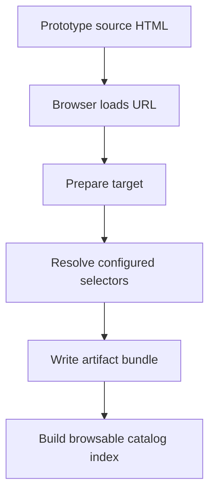

# Postmortem: Building the Extensive Pyxis Prototype Catalog

We achieved the goal: Pyxis now has an extensive prototype-first visual catalog workflow. It can extract screenshots, computed CSS, prepared HTML, inspect JSON, and metadata from the prototype source of truth. It covers Foundations, top-level public pages, and public-site widgets. It also has a browsable index and repeatable ticket-local scripts. That outcome matters because visual parity work is only reliable when the implementation can be compared against a named, reproducible baseline rather than a vague screenshot or a memory of what the design looked like.

It took longer than it should have. The time was not wasted; it exposed important problems in the catalog design and in `css-visual-diff`. The largest lesson is that a visual catalog is a software system, not a screenshot folder. It has source files, selectors, generated configs, browser behavior, error handling, documentation, and operational scripts. When any of those pieces are slightly wrong, the failure mode can look like “the browser is slow” even when the true problem is “a selector does not exist.”

This postmortem explains the system from first principles, walks through what we built, records the problems we encountered, and proposes concrete improvements for `css-visual-diff`, documentation, and the Pyxis catalog workflow.

## 1. The goal in one sentence

The goal was to build a prototype-first catalog of Pyxis visual elements so that Storybook and the React frontend can be repaired toward pixel-perfect parity.

That sentence has three important parts:

1. **Prototype-first.** The baseline comes from `prototype-design/Pyxis Public Site.html` and the Foundations portion of `prototype-design/Pyxis Full App.html`, not from the current React implementation.
2. **Catalog.** Each target should have a repeatable config and an artifact bundle, not a one-off screenshot.
3. **Repair-oriented.** The catalog exists so developers can compare implementation output to a concrete baseline and make focused changes.

The catalog is not merely for documentation. It is an input to future work.

## 2. The pieces of the system

A new intern should understand that there are four systems interacting here:

| System | Location | Role |
|---|---|---|
| Prototype HTML | `prototype-design/*.html` | Visual source of truth. |
| Prototype React source | `prototype-design/screens/*.jsx`, `prototype-design/lib/*.jsx` | Defines the components/pages rendered by the HTML files. |
| Catalog ticket workspace | `ttmp/.../PYXIS-STORYBOOK-CATALOG...` | Stores scripts, configs, playbooks, generated manifest metadata, and diary. |
| `css-visual-diff` | `/home/manuel/workspaces/2026-04-21/hair-v2/css-visual-diff` | Browser automation and artifact extraction tool. |

The important ticket path is:

```text
/home/manuel/code/wesen/2026-04-23--pyxis/ttmp/2026/04/23/PYXIS-STORYBOOK-CATALOG--build-storybook-screenshot-and-css-catalog-for-atoms-molecules-and-public-components
```

The important `css-visual-diff` implementation path is:

```text
/home/manuel/workspaces/2026-04-21/hair-v2/css-visual-diff/internal/cssvisualdiff/modes/inspect.go
```

The prototype public site source is:

```text
prototype-design/Pyxis Public Site.html
prototype-design/screens/ppxis.jsx
```

The Foundations source is:

```text
prototype-design/Pyxis Full App.html
prototype-design/screens/system.jsx
prototype-design/lib/components.jsx
```

## 3. The final catalog shape

The generated prototype baseline matrix currently contains:

| Category | Count |
|---|---:|
| Foundations/SystemPage configs | 1 |
| Public top-level page configs | 10 |
| Public component/widget configs | 18 |
| Total prototype configs | 29 |
| Total configured style probes | 165 |

The ten public page configs are the five public pages in desktop and mobile variants:

```text
shows / shows-mobile
detail / detail-mobile
archive / archive-mobile
book / book-mobile
about / about-mobile
```

The eighteen widget/component configs are:

```text
poster-redroom
poster-pixel808
poster-petals
poster-meetups
poster-basement
poster-orphx
poster-moor
poster-cygnus
poster-zola
show-tile-redroom
show-tile-compact
nav-desktop
nav-mobile
footer-desktop
footer-mobile
page-header-shows
show-grid-desktop
show-grid-mobile
```

The sample runner currently exercises 16 representative configs and produced 106 screenshot bundles in the latest validation run. That sample is intentionally broad enough to catch page-level and component-level selector mistakes before the full 29-config run.

## 4. The artifact model

Every useful baseline target should produce a small evidence bundle:

```text
screenshot.png
computed-css.md
computed-css.json
prepared.html
inspect.json
metadata.json
```

Each file has a different job.

| File | What it answers |
|---|---|
| `screenshot.png` | What did the browser paint for this selector? |
| `computed-css.md` | What did the browser compute for the configured CSS properties? |
| `computed-css.json` | What can scripts consume later? |
| `prepared.html` | What DOM existed after loading and preparing the target? |
| `inspect.json` | What are the bounds, attributes, text, and child structure? |
| `metadata.json` | Which selector, URL, viewport, and target produced this artifact? |

This is the central design idea. A screenshot alone is not enough. It can be visually plausible and still be the wrong element. The CSS and DOM artifacts tell us whether the selector and render target were correct.

## 5. The extraction pipeline

At a high level, extraction looks like this:



There are two preparation strategies.

### Strategy A: standalone pages

Standalone pages are used when the target is a full public page. They live under:

```text
prototype-design/standalone/public/*.html
prototype-design/standalone/foundations/system.html
```

A standalone page renders one page directly into `#root`. For example:

```text
http://localhost:7070/standalone/public/shows.html
```

A config for a standalone page uses a simple script prepare hook:

```yaml
original:
  url: "http://localhost:7070/standalone/public/shows.html"
  viewport: { width: 920, height: 1660 }
  root_selector: "#root"
  prepare:
    type: script
    wait_for: "document.querySelector('#root > *:first-child') && (!document.fonts || document.fonts.status === 'loaded')"
    script: |
      const root = document.querySelector('#root');
      if (root) {
        root.style.minHeight = '0px';
        root.style.height = 'auto';
      }
      document.body.style.margin = '0';
    after_wait_ms: 250
```

### Strategy B: direct React global fixtures

Direct global fixtures are used when the target is a component-sized thing: poster, show tile, nav, footer, page header, show grid, or Foundations/SystemPage.

The prototype exposes browser globals in `prototype-design/screens/ppxis.jsx`, such as:

```text
PPXCatalogPoster
PPXCatalogShowTile
PPXCatalogNav
PPXCatalogFooter
PPXCatalogPageHeader
PPXCatalogShowGrid
```

A direct-render config looks like this:

```yaml
prepare:
  type: direct-react-global
  wait_for: "window.React && window.ReactDOM && window.PPXCatalogShowTile"
  component: PPXCatalogShowTile
  root_selector: "#capture-root"
  props: { index: 0, compact: false, width: 270 }
  width: 270
  min_height: 430
  background: "#fff"
  after_wait_ms: 500
```

The mental model is: load the prototype HTML, wait for the component to exist on `window`, replace the document with `#capture-root`, and render the named component there.

## 6. Pseudocode: how `inspect --all-styles` works

A key question was whether `--all-styles` reloads the page for every style. It does not. The relevant flow in `css-visual-diff/internal/cssvisualdiff/modes/inspect.go` is effectively:

```go
func Inspect(ctx, cfg, opts) {
    target := select original or react side
    requests := BuildInspectRequests(cfg, opts) // all styles become many requests

    browser := NewBrowser(ctx)
    page := browser.NewPage()

    page.SetViewport(target.Viewport)
    page.Goto(target.URL)
    if target.WaitMS > 0 { page.Wait(target.WaitMS) }
    prepareTarget(page, target)

    for _, req := range requests {
        writeInspectArtifacts(page, target, req)
    }
}
```

So a single config with `--all-styles` performs one browser page navigation and one prepare call. It then loops the selectors on that prepared page.

The shell runners do run one CLI process per config. Therefore:

- one config = one page load and one prepare,
- 16 sample configs = 16 page loads/prepares,
- 29 full configs = 29 page loads/prepares.

This is an acceptable starting design, but it suggests future optimization: a batch mode could reuse one browser across configs.

## 7. What we built

The main script added for the extensive catalog is:

```text
scripts/11-generate-prototype-baseline-configs.mjs
```

It generates the 29 configs and writes a manifest:

```text
various/prototype-baseline/manifest.json
```

The sample runner is:

```text
scripts/06-run-prototype-baseline-sample.sh
```

The full runner is:

```text
scripts/07-run-prototype-baseline-full.sh
```

The index builder is:

```text
scripts/12-build-prototype-baseline-index.mjs
```

The local index server is:

```text
scripts/13-serve-prototype-baseline-index.sh
```

The typical command sequence is:

```bash
cd /home/manuel/code/wesen/2026-04-23--pyxis

# 1. Generate configs and manifest.
ttmp/2026/04/23/PYXIS-STORYBOOK-CATALOG--build-storybook-screenshot-and-css-catalog-for-atoms-molecules-and-public-components/scripts/11-generate-prototype-baseline-configs.mjs

# 2. Run representative sample.
ttmp/2026/04/23/PYXIS-STORYBOOK-CATALOG--build-storybook-screenshot-and-css-catalog-for-atoms-molecules-and-public-components/scripts/06-run-prototype-baseline-sample.sh

# 3. Build index.
ttmp/2026/04/23/PYXIS-STORYBOOK-CATALOG--build-storybook-screenshot-and-css-catalog-for-atoms-molecules-and-public-components/scripts/12-build-prototype-baseline-index.mjs

# 4. Serve index.
ttmp/2026/04/23/PYXIS-STORYBOOK-CATALOG--build-storybook-screenshot-and-css-catalog-for-atoms-molecules-and-public-components/scripts/13-serve-prototype-baseline-index.sh
```

The local index opens at:

```text
http://localhost:8795/index.html
```

## 8. Problem 1: trusting selectors before verifying the DOM

The first serious problem was selector mismatch. The generated Foundations config originally contained selectors like:

```css
#capture-root [data-part="badge"]:first-of-type
#capture-root [data-part="tag"]:first-of-type
```

Those selectors looked reasonable because the React implementation components use `data-part`. For example, the component library `Badge` and `Tag` expose `data-part="badge"` and `data-part="tag"`.

But the prototype Foundations source does not. In `prototype-design/lib/components.jsx`, `Badge` and `Tag` are just styled spans. They do not define `data-part`.

The mistake was subtle: we mixed the implementation selector contract into the prototype baseline config. That violated the prototype-first rule. A prototype selector must match the prototype DOM, not the implementation DOM.

### The fix

The user asked to use card-level probes. That was the right immediate decision.

Instead of trying to extract individual badge/tag/button/input atoms from Foundations, the generator now extracts stable card-level regions:

```text
badges-tags-card
buttons-card
form-fields-card
stats-card
icons-card
radii-elevation-card
navigation-card
log-rows-card
empty-state-card
principles
```

This avoids the invalid `[data-part]` selectors and still gives useful visual/CSS baseline evidence for the Foundations system page.

### Future alternative

If we later need atom-level Foundations probes from the prototype, we should add prototype-specific attributes such as:

```jsx
<span data-proto-part="badge" ...>
```

Then the config can use:

```css
#capture-root [data-proto-part="badge"]
```

But we should not pretend the prototype already exposes the React implementation API.

## 9. Problem 2: missing selectors looked like slow extraction

The original symptom was not a nice error. The command appeared to hang. It reached the `badge` style, wrote `metadata.json` and `prepared.html`, and then stopped until the shell-level timeout killed it.

The reason was in `css-visual-diff`:

```go
if format == InspectFormatBundle || format == InspectFormatPNG {
    pngPath := filepath.Join(outDir, "screenshot.png")
    if err := page.Screenshot(req.Selector, pngPath); err != nil {
        return artifact, err
    }
}
```

And in the driver:

```go
func (p *Page) Screenshot(selector, path string) error {
    var buf []byte
    if err := chromedp.Run(p.ctx, chromedp.Screenshot(selector, &buf, chromedp.ByQuery)); err != nil {
        return err
    }
    return os.WriteFile(path, buf, 0o644)
}
```

If the selector did not exist, `chromedp.Screenshot` could wait instead of immediately returning a useful error. The shell runner had `timeout 120s`, so the failure looked like a performance problem.

### The fix

We patched `css-visual-diff inspect` to preflight selector existence before selector-backed artifacts.

Conceptually:

```go
func writeInspectArtifacts(...) {
    write metadata

    if format requires an existing selector {
        ensureInspectSelectorExists(page, req)
    }

    write prepared HTML
    write screenshot
    write computed CSS
    write inspect JSON
}
```

The added helper is conceptually:

```go
func ensureInspectSelectorExists(page, req) error {
    style := evaluateStyle(page, StyleSpec{
        Selector: req.Selector,
        Props: [],
        Attributes: [],
        IncludeBounds: true,
    })

    if !style.Exists {
        return fmt.Errorf("%s %q selector did not match: %s", req.Source, req.Name, req.Selector)
    }

    return nil
}
```

Now a missing selector fails immediately with an actionable message:

```text
style "first-show-tile" selector did not match: #root > div > main > :nth-child(2) > div:first-child
```

This is much better than waiting for the shell timeout.

## 10. Problem 3: page selectors were shifted by fragment output

The public page components use `PageHeader`, and `PageHeader` returns a React fragment with two siblings:

1. the header block,
2. a divider rule.

That means the page content begins at `main > :nth-child(3)`, not `main > :nth-child(2)`.

For Shows, the first generated selector was:

```css
#root > div > main > :nth-child(2) > div:first-child
```

But `:nth-child(2)` was the divider, not the show grid. After `css-visual-diff` failed fast, we could quickly see and fix the problem.

The corrected selector is:

```css
#root > div > main > :nth-child(3) > div:first-child
```

Similar shifts were applied to Archive, Book, and About page section selectors.

This is a good example of why prepared HTML and fast selector failure matter. Without them, structural selectors become guesswork.

## 11. What went well

Several parts of the system worked well once the selector problems were corrected.

- `direct-react-global` is the right mechanism for component-sized prototype baselines.
- Standalone HTML entrypoints are the right mechanism for full public pages.
- `inspect --all-styles` has the right page-loading shape: one navigation/prepare per config.
- The ticket-local script convention made the workflow reproducible.
- The generated manifest and index make the catalog discoverable.
- The `read` image tool was useful for validating sample PNGs without relying on dimensions alone.

The workflow also produced concrete, reviewable evidence. For example, the Foundations badges/tags card screenshot confirmed that card-level probes capture the intended visual region, and the Shows grid screenshot confirmed that the page-level grid selector now points at the correct element.

## 12. What should have been done differently

The main thing we should have done earlier was selector preflight.

The correct authoring loop should be:

```text
generate config
  ↓
preflight all selectors
  ↓
if selector missing: print compact table and stop
  ↓
write screenshots/CSS/HTML/inspect artifacts
  ↓
inspect sample PNGs
  ↓
run full catalog
```

Instead, the initial loop was:

```text
generate config
  ↓
run all-styles bundle extraction
  ↓
hang during screenshot for missing selector
  ↓
use shell timeout as failure detector
```

That is too slow and too opaque. Tooling should not require the operator to infer missing selectors from partial output directories.

We also should have separated selector classes more explicitly in the documentation:

| Selector family | Where it belongs |
|---|---|
| `data-catalog` | Prototype public component fixtures. |
| `data-proto-part` | Future prototype atom-level probes, if added. |
| `data-part` | React implementation components. |
| Structural `nth-child` selectors | Last resort for stable prototype page/card structures. |

The lack of that table made it easier to accidentally use `data-part` against the prototype.

## 13. What `css-visual-diff` should improve next

The tool is useful, but the experience could be much better for catalog authoring.

### 13.1 Config-level selector preflight

The new per-artifact preflight is a good safety net, but it still fails on the first missing selector. A better authoring mode would check all selectors first and report a table:

```text
$ css-visual-diff inspect --config prototype-public-shows.yml --side original --preflight

OK      full-shell        #root
OK      nav               #root > div > header
OK      page-header       #root > div > main > :first-child
MISSING first-show-tile   #root > div > main > :nth-child(2) > div:first-child
OK      footer            #root > div > footer
```

Pseudocode:

```go
func PreflightSelectors(page, requests) []SelectorStatus {
    statuses := []SelectorStatus{}
    for _, req := range requests {
        status := EvaluateSelectorStatus(page, req.Selector)
        statuses = append(statuses, status)
    }
    return statuses
}
```

This would turn selector debugging into a short feedback loop.

### 13.2 Batch mode across configs

The current shell runners execute one CLI invocation per config. That means one browser lifecycle per config. A batch mode could reuse one browser:

```bash
css-visual-diff inspect-batch \
  --configs sources/prototype-configs/**/*.yml \
  --side original \
  --all-styles \
  --out various/prototype-baseline/artifacts
```

Pseudocode:

```go
func InspectBatch(configs []Config) {
    browser := NewBrowser(ctx)
    defer browser.Close()

    for _, cfg := range configs {
        page := browser.NewPage()
        InspectConfigOnExistingBrowser(browser, page, cfg)
        page.Close()
    }
}
```

This would reduce startup overhead and give the tool a place to produce one combined status report.

### 13.3 CSS-only fast path

Many catalog probes do not need full PNG + HTML + inspect JSON on every run. During CSS repair, the operator often wants only computed CSS.

A fast path could look like:

```bash
css-visual-diff inspect --config cfg.yml --side original --all-styles --format css-md
```

This already partially exists through formats, but the documentation and runners should make it a first-class workflow:

1. Run CSS-only to validate properties and selectors.
2. Run screenshot bundles only for representative or changed probes.
3. Run full bundle before publishing the catalog.

### 13.4 Root prepared HTML once per config

Currently, bundle mode writes `prepared.html` per style. That is useful when debugging a specific selector, but it is repetitive for large catalogs.

A better output mode could be:

```yaml
output:
  write_root_prepared_html_once: true
  write_per_style_prepared_html: false
```

Then each style bundle could link back to:

```text
_root/prepared.html
```

This would reduce I/O and make the artifact tree easier to browse.

### 13.5 Better timing output

The tool should print timing per phase:

```text
load: 812ms
prepare: 540ms
preflight: 12ms
full-shell screenshot: 420ms
nav screenshot: 90ms
computed CSS total: 36ms
inspect JSON total: 280ms
```

Without timing, it is hard to tell whether slowness comes from page load, prepare, screenshot size, computed CSS, or filesystem writes.

### 13.6 Better docs for failure modes

The docs should explicitly explain:

- missing selectors,
- selectors that match wrappers instead of styled children,
- page fragments that shift `nth-child` paths,
- the difference between `sections[]` and `styles[]`,
- when to use `--all-styles`, `--style`, `--root`, and CSS-only formats,
- how many page loads happen per command.

The docs currently explain the basics, but they need a stronger debugging section grounded in real failures.

## 14. Documentation improvements for the Pyxis ticket

The ticket documentation is now much better, but it could still improve.

### Add a one-page operator checklist

A new intern should have a checklist like:

```text
1. Run generator.
2. Run selector preflight or sample.
3. Inspect three PNGs.
4. Build index.
5. Serve index.
6. Update diary/changelog.
7. Commit configs/scripts/docs, not generated artifacts.
```

### Add a selector contract table

The docs should include this rule prominently:

| Prefix | Meaning | Use in prototype? | Use in React? |
|---|---|---:|---:|
| `data-catalog` | Prototype fixture wrapper | Yes | No |
| `data-proto-part` | Future prototype atom marker | Yes | No |
| `data-part` | React component part marker | No, unless prototype explicitly adds it | Yes |
| `data-section` | React/user-site page section marker | Usually no | Yes |

### Add a performance explanation

The playbooks now mention that `--all-styles` does not reload per style, but this should also be in a quick reference page. Operators need to know whether they are paying per style or per config.

## 15. Review checklist for the current work

A reviewer should check the Pyxis repo and `css-visual-diff` repo separately.

### Pyxis catalog review

Start with:

```text
scripts/11-generate-prototype-baseline-configs.mjs
scripts/06-run-prototype-baseline-sample.sh
scripts/07-run-prototype-baseline-full.sh
scripts/12-build-prototype-baseline-index.mjs
scripts/13-serve-prototype-baseline-index.sh
```

Then inspect generated configs:

```text
sources/prototype-configs/prototype-foundations-system.css-visual-diff.yml
sources/prototype-configs/prototype-public-shows.css-visual-diff.yml
sources/prototype-configs/prototype-public-about-mobile.css-visual-diff.yml
sources/prototype-configs/public-components/show-tile-redroom.css-visual-diff.yml
sources/prototype-configs/public-components/show-grid-mobile.css-visual-diff.yml
```

Validate with:

```bash
cd /home/manuel/code/wesen/2026-04-23--pyxis
scripts_path="ttmp/2026/04/23/PYXIS-STORYBOOK-CATALOG--build-storybook-screenshot-and-css-catalog-for-atoms-molecules-and-public-components/scripts"

$scripts_path/11-generate-prototype-baseline-configs.mjs
$scripts_path/06-run-prototype-baseline-sample.sh
$scripts_path/12-build-prototype-baseline-index.mjs
$scripts_path/13-serve-prototype-baseline-index.sh
```

Then open:

```text
http://localhost:8795/index.html
```

### `css-visual-diff` review

Start with:

```text
/home/manuel/workspaces/2026-04-21/hair-v2/css-visual-diff/internal/cssvisualdiff/modes/inspect.go
/home/manuel/workspaces/2026-04-21/hair-v2/css-visual-diff/internal/cssvisualdiff/modes/inspect_test.go
```

Validate with:

```bash
cd /home/manuel/workspaces/2026-04-21/hair-v2/css-visual-diff
go test ./internal/cssvisualdiff/modes ./cmd/css-visual-diff
make install
```

A manual missing-selector test should fail quickly:

```text
flag "selector" selector did not match: #missing
```

## 16. Final lessons

The catalog succeeded because we eventually treated it as a system. We separated prototype baselines from React implementation selectors. We added a generator rather than hand-maintaining dozens of YAML files. We added a representative sample before the full run. We fixed the tool so missing selectors fail immediately. We updated the playbooks and diary so the next developer does not have to rediscover the same failure modes.

The main lesson is that visual tooling needs excellent failure behavior. A missing selector is a normal authoring mistake. It should not look like a slow browser, a hung process, or an unexplained timeout. It should look like this:

```text
style "badge" selector did not match: #capture-root [data-part="badge"]
```

Once the tool says that, the developer can fix the config in seconds. Without it, they lose minutes and confidence.

The next round of work should focus on making this faster and more ergonomic: batch mode, config-level preflight, timing output, CSS-only workflows, and clearer docs. Those improvements would turn `css-visual-diff` from a powerful but somewhat sharp tool into a smooth catalog-authoring workbench.
