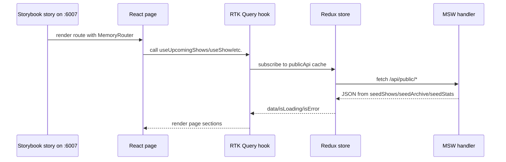

# Public Site Page Build Analysis, Design, and Implementation Guide

## 1. Executive summary

This ticket starts the next phase of the Pyxis frontend work: building the complete public site pages in `pyxis-user-site` by composing the reusable atoms, molecules, organisms, and public components that now live in `pyxis-components`.

The previous tickets established the foundation:

- component-level visual parity coverage exists for many atoms, molecules, organisms, and public components;
- public component CSS has been extracted into component-local CSS files with stable `data-pyxis-component` / `data-pyxis-part` selectors;
- `pyxis-types` now centralizes public API/domain types;
- `pyxis-user-site` now uses RTK Query instead of TanStack React Query;
- user-site Storybook page stories run on port `6007` and are wired through Redux Provider + MSW handlers.

The goal of this ticket is to make the React page stories match the standalone public prototype baselines, using the same bottom-up and iterative approach that worked for component parity:

```text
canonical public components → page sections → full React page stories → page-level visual-diff configs → page acceptance/tuning
```

We are **not** starting from blank pages. Current pages already exist under:

```text
web/packages/pyxis-user-site/src/pages
```

but many still contain large page-local inline style blocks and older component choices. The next work should replace those page-local layouts with canonical reusable public components wherever possible.

## 2. The mental model

Think of the system as four cooperating layers:

```text
Layer 1: Prototype baselines
  Static HTML files under prototype-design/standalone/public/*.html.
  These are the visual source of truth for full public pages.

Layer 2: Component system
  Reusable UI package under web/packages/pyxis-components.
  Contains atoms, molecules, organisms, tokens, and public page building blocks.

Layer 3: Application data and routing
  pyxis-user-site owns routes, RTK Query hooks, Redux store, and page-level composition.

Layer 4: Page Storybook + visual-diff harness
  User-site Storybook on port 6007 renders pages with MemoryRouter, Redux Provider, and MSW data.
  css-visual-diff compares those stories against standalone prototype pages.
```

The intern's job is to keep these layers separate:

- Do not duplicate component internals in pages.
- Do not put app data fetching inside `pyxis-components`.
- Do not change backend/API types ad hoc in page files; update `pyxis-types` if a contract changes.
- Do not tune a full page by hardcoding many local styles if a reusable component already exists.
- Do not accept page-level visual diffs until the page's component choices and selector scopes are understood.

## 3. Important directories and files

### 3.1 Prototype baselines

These are static prototype pages that the React Storybook pages should match:

```text
prototype-design/standalone/public/shows.html
prototype-design/standalone/public/detail.html
prototype-design/standalone/public/archive.html
prototype-design/standalone/public/book.html
prototype-design/standalone/public/about.html
```

Use them as the original side for page-level visual comparisons. They are separate from the older monolithic prototype page.

### 3.2 User-site React pages

The application pages currently live here:

```text
web/packages/pyxis-user-site/src/pages/Shows.tsx
web/packages/pyxis-user-site/src/pages/ShowDetail.tsx
web/packages/pyxis-user-site/src/pages/Archive.tsx
web/packages/pyxis-user-site/src/pages/Book.tsx
web/packages/pyxis-user-site/src/pages/BookSuccess.tsx
web/packages/pyxis-user-site/src/pages/About.tsx
web/packages/pyxis-user-site/src/pages/NotFound.tsx
```

The five main page targets are:

```text
Shows.tsx       ↔ prototype-design/standalone/public/shows.html
ShowDetail.tsx  ↔ prototype-design/standalone/public/detail.html
Archive.tsx     ↔ prototype-design/standalone/public/archive.html
Book.tsx        ↔ prototype-design/standalone/public/book.html
About.tsx       ↔ prototype-design/standalone/public/about.html
```

### 3.3 User-site Storybook page stories

User-site page stories live here:

```text
web/packages/pyxis-user-site/stories/PublicPages.stories.tsx
```

They currently render each page inside:

- `Provider` from `react-redux`,
- `makeStore()` from `src/store.ts`,
- `MemoryRouter`,
- app `Layout`,
- MSW handlers from `pyxis-components/mocks/handlers`.

Current story ids include:

```text
public-site-pages--shows-desktop
public-site-pages--shows-mobile
public-site-pages--show-detail-desktop
public-site-pages--show-detail-mobile
public-site-pages--archive-desktop
public-site-pages--archive-mobile
public-site-pages--book-desktop
public-site-pages--book-mobile
public-site-pages--about-desktop
public-site-pages--about-mobile
```

The Storybook dev server for these stories should run on port `6007`:

```bash
cd web
pnpm --filter pyxis-user-site storybook
```

For long-running work, run it in tmux:

```bash
tmux new-session -d -s pyxis-user-site-storybook \
  'cd /home/manuel/code/wesen/2026-04-23--pyxis/web && pnpm --filter pyxis-user-site storybook'
```

### 3.4 Component system exports

The component package entrypoint is:

```text
web/packages/pyxis-components/src/index.ts
```

It exports atoms, molecules, organisms, and public components such as:

```text
Atoms: Button, Icon, Input, Select, Textarea, Badge, Tag
Molecules: Empty, Card, Stat, Field, Table
Organisms: TopBar, Modal
Public shell: PubNav, PubFooter, PublicPageHeader
Shows: PubHero, Poster, ShowTile, ShowGrid, TicketStub
Show detail: ShowDetailHeader, ShowMetaStrip, ReserveTicketCard, LineupRow, SafetyNote, VenueCard
Archive: ArchiveSearchFilters, ArchiveShowRow, ArchiveShowList, ArchiveStats, YearGroup
Booking: BookingForm, BookingRules, BookingSpaceAside, SaferSpaceAgreement, BookingSuccess
About: AboutHero, AboutIntro, EthosGrid, CollectiveList, FindUsBlock
Legacy/deferred: PubShowRow, EthosStrip, SpaceInfo
```

When building pages, prefer imports from the package barrel:

```ts
import { ShowGrid, PublicPageHeader } from 'pyxis-components';
```

Do not reach into private component paths unless the package export is missing and you are intentionally adding it.

### 3.5 Shared types

Shared public API/domain types live in:

```text
web/packages/pyxis-types/src/public.ts
```

Use these types for app data, component props, and MSW mocks:

```ts
import type { Show, ArchivedShow, BookingFormData } from 'pyxis-types';
```

Compatibility re-export files currently exist but should not be preferred for new code:

```text
web/packages/pyxis-user-site/src/api/types.ts
web/packages/pyxis-components/src/mocks/types.ts
```

### 3.6 RTK Query data layer

The public app data layer is now RTK Query:

```text
web/packages/pyxis-user-site/src/api/publicApi.ts
web/packages/pyxis-user-site/src/api/hooks.ts
web/packages/pyxis-user-site/src/store.ts
```

`publicApi.ts` defines generated hooks:

```ts
useGetUpcomingShowsQuery()
useGetShowQuery(id)
useGetArchiveQuery(search)
useGetArchiveStatsQuery()
useSubmitBookingMutation()
```

`hooks.ts` currently exposes compatibility hook names:

```ts
useUpcomingShows()
useShow(id)
useArchive(search)
useArchiveStats()
useSubmitBooking()
```

Page work can keep using compatibility hooks for now, or migrate pages to generated hook names in a dedicated cleanup commit.

## 4. Current state of the pages

### 4.1 `Shows.tsx`

Current page behavior:

- fetches upcoming shows with `useUpcomingShows()`;
- renders the first show as `PubHero`;
- renders remaining shows with `PubShowRow`;
- renders `MailingListCTA`;
- has local inline layout styles.

Target direction:

- preserve RTK Query data behavior;
- replace `PubShowRow` usage with `ShowGrid` / `ShowTile` if matching `shows.html` poster-grid design;
- keep `PubHero` only if the prototype baseline has a hero feature section;
- extract page layout into page CSS or compose a page section component if repeated;
- add page-level visual-diff config against `shows.html`.

Potential final composition pseudocode:

```tsx
export function Shows() {
  const { data: shows = [], isLoading, isError, error } = useUpcomingShows();

  if (isLoading) return <ShowsSkeleton />;
  if (isError) return <PageError message={getApiErrorMessage(error)} />;
  if (shows.length === 0) return <Empty title="No upcoming shows" />;

  const [featured, ...upcoming] = shows;

  return (
    <main data-page="shows" className="pyxis-public-page pyxis-shows-page">
      <PubHero show={featured} />
      <section data-section="shows-grid">
        <ShowGrid shows={upcoming.length ? upcoming : shows} />
      </section>
      <MailingListCTA />
    </main>
  );
}
```

### 4.2 `ShowDetail.tsx`

Current page behavior:

- reads route param with `useParams()`;
- fetches a show with `useShow(id)`;
- renders a custom dark hero, `TicketStub`, `LineupRow`, and `VenueCard`;
- has many page-local inline styles.

Target direction:

- replace custom dark hero with canonical `ShowDetailHeader`;
- use `ShowMetaStrip` for time/age/price/genre metadata;
- use `ReserveTicketCard` instead of ad hoc ticket action area;
- keep `LineupRow` for lineup;
- use `SafetyNote` for capacity/sell-out/care note;
- choose `VenueCard` or `BookingSpaceAside` per taxonomy decision;
- match `detail.html` through user-site Storybook.

Potential final composition pseudocode:

```tsx
export function ShowDetail() {
  const id = Number(useParams().id);
  const { data: show, isLoading, isError } = useShow(Number.isFinite(id) ? id : undefined);

  if (isLoading) return <ShowDetailSkeleton />;
  if (isError || !show) return <NotFoundPanel />;

  return (
    <main data-page="show-detail" className="pyxis-public-page pyxis-show-detail-page">
      <ShowDetailHeader show={show} />
      <ShowMetaStrip items={buildShowMetaItems(show)} />
      <div className="pyxis-show-detail-page__content">
        <article>
          <ShowDescription show={show} />
          <LineupList lineup={show.lineup ?? []} />
        </article>
        <aside>
          <ReserveTicketCard show={show} />
          <SafetyNote />
          <VenueCard />
        </aside>
      </div>
    </main>
  );
}
```

### 4.3 `Archive.tsx`

Current page behavior:

- fetches archive rows with `useArchive(search)`;
- fetches stats with `useArchiveStats()`;
- uses atom `Input` and public `ArchiveStats`;
- locally implements `YearGroups` and `ArchiveRow` with inline styles.

Target direction:

- use `PublicPageHeader` for the page title and intro;
- use `ArchiveSearchFilters` for search UI if its props fit or extend them carefully;
- use `ArchiveStats` for totals;
- use `YearGroup`, `ArchiveShowList`, and `ArchiveShowRow` instead of local implementations;
- decide where search filtering belongs: API query string, local filtering, or both;
- match `archive.html`.

Potential final composition pseudocode:

```tsx
export function Archive() {
  const [search, setSearch] = useState('');
  const { data: rows = [], isLoading } = useArchive(search || undefined);
  const { data: stats } = useArchiveStats();
  const groups = groupArchivedShowsByYear(rows);

  return (
    <main data-page="archive" className="pyxis-public-page pyxis-archive-page">
      <PublicPageHeader title="Archive" description="Every show since day one." />
      <ArchiveSearchFilters value={search} onChange={setSearch} resultCount={rows.length} />
      {stats && <ArchiveStats stats={stats} />}
      {groups.map((group) => (
        <YearGroup key={group.year} year={group.year} count={group.shows.length}>
          <ArchiveShowList shows={group.shows} />
        </YearGroup>
      ))}
    </main>
  );
}
```

### 4.4 `Book.tsx`

Current page behavior:

- uses `useSubmitBooking()`;
- renders `BookingForm`, `SpaceInfo`, and `BookingRules`;
- navigates to `/book/success` after successful submission;
- has page-local inline layout.

Target direction:

- use `PublicPageHeader` for the page intro;
- use `BookingForm` for form body;
- use canonical `BookingSpaceAside` instead of `SpaceInfo` if matching `book.html`;
- use `BookingRules` and `SaferSpaceAgreement` where present in the baseline;
- use `BookingSuccess` for the success page / success state;
- match `book.html`.

Potential final composition pseudocode:

```tsx
export function Book() {
  const navigate = useNavigate();
  const submit = useSubmitBooking();

  async function handleSubmit(data: BookingFormData) {
    await submit.mutateAsync(data);
    navigate('/book/success');
  }

  return (
    <main data-page="book" className="pyxis-public-page pyxis-book-page">
      <PublicPageHeader title="Book us" description="We're always looking for interesting acts." />
      <div className="pyxis-book-page__layout">
        <BookingForm onSubmit={handleSubmit} isSubmitting={submit.isPending} />
        <aside>
          <BookingSpaceAside />
          <BookingRules />
          <SaferSpaceAgreement />
        </aside>
      </div>
    </main>
  );
}
```

### 4.5 `About.tsx`

Current page behavior:

- uses `AboutHero`, `EthosStrip`, and `Button`;
- locally implements about copy, visit info, and placeholder image;
- has page-local inline styles.

Target direction:

- use `AboutHero` for the headline area;
- use `AboutIntro` for the prose section;
- use `EthosGrid` rather than `EthosStrip` for the canonical about-page ethos block;
- use `CollectiveList` and `FindUsBlock`;
- keep or replace hero image placeholder depending on `about.html`;
- match `about.html`.

Potential final composition pseudocode:

```tsx
export function About() {
  return (
    <main data-page="about" className="pyxis-public-page pyxis-about-page">
      <AboutHero />
      <AboutIntro />
      <EthosGrid />
      <CollectiveList />
      <FindUsBlock />
    </main>
  );
}
```

## 5. Canonical component taxonomy for page work

Use the taxonomy ADR from the previous ticket as the starting decision set.

### Public shell

```text
PubNav
PubFooter
PublicPageHeader
```

### Shows page

```text
PubHero
ShowGrid
ShowTile
Poster
MailingListCTA
```

`PubShowRow` is deferred. Do not polish it further unless the page baseline clearly requires a row-style upcoming show list.

### Show detail page

```text
ShowDetailHeader
ShowMetaStrip
ReserveTicketCard
LineupRow
SafetyNote
VenueCard or BookingSpaceAside
```

Use `VenueCard` only if a compact detail-page venue card is appropriate. Use `BookingSpaceAside` if the detail page needs the richer venue/spec panel.

### Archive page

```text
PublicPageHeader
ArchiveSearchFilters
ArchiveStats
YearGroup
ArchiveShowList
ArchiveShowRow
```

Do not use `PubShowRow` for archive content.

### Booking page

```text
PublicPageHeader
BookingForm
BookingSpaceAside
BookingRules
SaferSpaceAgreement
BookingSuccess
MailingListCTA
```

### About page

```text
AboutHero
AboutIntro
EthosGrid
CollectiveList
FindUsBlock
```

`EthosStrip` is a compact/home variant. Prefer `EthosGrid` for the about page unless the baseline proves otherwise.

## 6. Data flow and API references

### 6.1 Request flow



### 6.2 RTK Query API slice

File:

```text
web/packages/pyxis-user-site/src/api/publicApi.ts
```

Endpoints:

```ts
getUpcomingShows: GET /api/public/shows
getShow:          GET /api/public/shows/:id
getArchive:       GET /api/public/archive?search=...
getArchiveStats:  GET /api/public/archive/stats
submitBooking:    POST /api/public/submissions
```

Use the compatibility hooks from:

```text
web/packages/pyxis-user-site/src/api/hooks.ts
```

unless a task explicitly asks to migrate pages to generated RTK Query hook names.

### 6.3 MSW handlers

File:

```text
web/packages/pyxis-components/src/mocks/handlers.ts
```

Exports:

```ts
handlers
seedShows
seedArchive
seedStats
```

User-site Storybook attaches these handlers through story parameters and the Storybook preview loader. This allows the page stories to fetch realistic data without a backend server.

### 6.4 Store setup

File:

```text
web/packages/pyxis-user-site/src/store.ts
```

Important exports:

```ts
makeStore()
store
RootState
AppDispatch
useAppDispatch()
useAppSelector()
```

Use `makeStore()` in Storybook so each story gets a fresh RTK Query cache.

## 7. Storybook page workflow on port 6007

### 7.1 Start Storybook

```bash
cd /home/manuel/code/wesen/2026-04-23--pyxis/web
pnpm --filter pyxis-user-site storybook
```

Recommended tmux session:

```bash
tmux new-session -d -s pyxis-user-site-storybook \
  'cd /home/manuel/code/wesen/2026-04-23--pyxis/web && pnpm --filter pyxis-user-site storybook'

tmux capture-pane -pt pyxis-user-site-storybook -S -80
```

Open:

```text
http://localhost:6007
```

Useful iframe URLs:

```text
http://localhost:6007/iframe.html?id=public-site-pages--shows-desktop&viewMode=story
http://localhost:6007/iframe.html?id=public-site-pages--show-detail-desktop&viewMode=story
http://localhost:6007/iframe.html?id=public-site-pages--archive-desktop&viewMode=story
http://localhost:6007/iframe.html?id=public-site-pages--book-desktop&viewMode=story
http://localhost:6007/iframe.html?id=public-site-pages--about-desktop&viewMode=story
```

### 7.2 Story shape

Current `PublicPages.stories.tsx` uses a reusable story renderer:

```tsx
function PublicPageRoute({ route, storyName, width, minHeight }) {
  const store = makeStore();

  return (
    <div data-story="pyxis-public-page" data-story-name={storyName}>
      <div data-story-frame="pyxis-page-shell" style={{ width, minHeight }}>
        <Provider store={store}>
          <MemoryRouter initialEntries={[route]}>
            <Routes>{/* routes */}</Routes>
          </MemoryRouter>
        </Provider>
      </div>
    </div>
  );
}
```

Keep the outer `data-story` and `data-story-frame` attributes stable. They are useful for visual-diff selectors.

### 7.3 Add more stories before page-level comparison

For each page, add at least:

- desktop story,
- mobile story,
- loading story if feasible,
- empty/error story if feasible,
- long-content story if the baseline or component behavior needs it.

Potential story additions:

```text
ShowsEmpty
ShowsLongLineup
ShowDetailSoldOutOrCancelled
ArchiveFilteredEmpty
BookSubmitting
BookSuccess
AboutLongCopy
```

For data variants, prefer MSW handler overrides in story parameters rather than hardcoding alternate page data inside the page component.

## 8. Visual-diff workflow for full pages

### 8.1 Principle

Do not start by comparing all pages at once. Use this loop:

```text
1. choose one page
2. inspect prototype baseline DOM/screenshot
3. inspect Storybook page crop
4. map sections to canonical components
5. edit one page/section
6. typecheck
7. run page visual-diff config
8. update diary and parity map/status
9. commit
```

### 8.2 Proposed page-level config directory

Create page configs under a new directory such as:

```text
prototype-design/visual-diff/comparisons/public-pages/shows-desktop.css-visual-diff.yml
prototype-design/visual-diff/comparisons/public-pages/show-detail-desktop.css-visual-diff.yml
prototype-design/visual-diff/comparisons/public-pages/archive-desktop.css-visual-diff.yml
prototype-design/visual-diff/comparisons/public-pages/book-desktop.css-visual-diff.yml
prototype-design/visual-diff/comparisons/public-pages/about-desktop.css-visual-diff.yml
```

Add mobile configs only after desktop selector/capture scopes are stable.

### 8.3 Suggested config shape

This is pseudocode. Match the exact `css-visual-diff` schema used in existing configs.

```yaml
slug: public-page-shows-desktop
original:
  url: http://localhost:7070/standalone/public/shows.html
  selector: body
react:
  url: http://localhost:6007/iframe.html?id=public-site-pages--shows-desktop&viewMode=story
  selector: '[data-story-frame="pyxis-page-shell"]'
sections:
  page:
    original: body
    react: '[data-story-frame="pyxis-page-shell"]'
  hero:
    original: '[data-section="shows-hero"]'
    react: '[data-section="shows-hero"]'
output:
  dir: prototype-design/visual-comparisons/public-pages/shows-desktop
```

Important: make selector scope explicit. Full-page diffs can become noisy if the original selector captures browser default margin or the React selector captures the Storybook shell.

### 8.4 Prototype server

The static prototype pages must be reachable by `css-visual-diff`. If no server is already running, serve the repository/prototype root as appropriate. Check existing project conventions before adding a new server.

Earlier work used prototype URLs on port `7070`. Keep page configs consistent with the existing harness.

### 8.5 Run commands

Inspect first:

```bash
css-visual-diff html \
  --config prototype-design/visual-diff/comparisons/public-pages/shows-desktop.css-visual-diff.yml \
  --side react \
  --root \
  --output-file /tmp/shows-react-root.html

css-visual-diff screenshot \
  --config prototype-design/visual-diff/comparisons/public-pages/shows-desktop.css-visual-diff.yml \
  --side react \
  --section page \
  --output-file /tmp/shows-react-page.png
```

Then run:

```bash
css-visual-diff run \
  --config prototype-design/visual-diff/comparisons/public-pages/shows-desktop.css-visual-diff.yml \
  --modes capture,cssdiff,matched-styles,pixeldiff,html-report
```

Directory run after several configs exist:

```bash
css-visual-diff run \
  --config-dir prototype-design/visual-diff/comparisons/public-pages
```

Generated output belongs under:

```text
prototype-design/visual-comparisons/
```

Do not commit generated visual comparison output unless explicitly requested.

## 9. Page styling rules

### 9.1 Use page CSS for layout, components for component visuals

The page may own:

- page max-width,
- section ordering,
- responsive page grid,
- page-specific spacing between sections,
- route-specific empty/loading/error wrappers.

Reusable components should own:

- card internals,
- rows,
- buttons/inputs,
- public motifs,
- show tiles,
- archive rows,
- booking form controls,
- about section internals.

Recommended page CSS files:

```text
web/packages/pyxis-user-site/src/pages/Shows.css
web/packages/pyxis-user-site/src/pages/ShowDetail.css
web/packages/pyxis-user-site/src/pages/Archive.css
web/packages/pyxis-user-site/src/pages/Book.css
web/packages/pyxis-user-site/src/pages/About.css
```

Example:

```tsx
import './Shows.css';

export function Shows() {
  return (
    <main data-page="shows" className="pyxis-public-page pyxis-shows-page">
      ...
    </main>
  );
}
```

```css
.pyxis-public-page {
  width: min(100%, 980px);
  margin-inline: auto;
  padding-inline: 32px;
}

.pyxis-shows-page__grid {
  margin-top: var(--space-8);
}
```

### 9.2 Keep stable page selectors

Use stable selectors for page and section boundaries:

```tsx
<main data-page="shows">
<section data-section="shows-hero">
<section data-section="shows-grid">
<section data-section="mailing-list">
```

These selectors are not just for tests. They help:

- visual-diff section crops,
- debugging screenshots,
- future page analytics/testing,
- intern orientation.

### 9.3 Avoid inline style regressions

Current pages still contain many inline styles. The goal is not to ban all inline styles immediately, but page rewiring should reduce them steadily.

Acceptable page inline styles:

- temporary Storybook wrapper dimensions,
- truly dynamic CSS variables,
- small one-off values during exploration before committing.

Before committing page work, run:

```bash
rg "style=\{\{" web/packages/pyxis-user-site/src/pages -g'*.tsx'
```

Classify any remaining hits in the diary.

## 10. Accessibility and behavior requirements

Do not sacrifice behavior for visual parity.

For every page:

- preserve route navigation through `react-router-dom`;
- preserve keyboard-accessible buttons and links;
- use semantic landmarks: `main`, `section`, `nav`, `footer`, `aside` where appropriate;
- maintain form label/control relationships in booking forms;
- keep loading, error, empty, and success states usable;
- do not turn interactive elements into plain `div` elements just to match pixels.

Booking form requirements:

- `onSubmit` must still submit `BookingFormData`;
- `isSubmitting` must still disable controls appropriately;
- successful submission must still navigate to `/book/success` or render `BookingSuccess` per final design;
- server validation errors should remain representable through `getApiErrorMessage` or future form error state.

## 11. Implementation phases

This ticket should proceed in phases. Each phase should have its own commits and diary entries.

### Phase 0 — Setup and baseline capture

Goal: make sure tools are ready and capture the current starting state.

Tasks:

- Run user-site typecheck.
- Start user-site Storybook on port `6007`.
- Confirm iframe URLs render.
- Confirm prototype standalone pages are reachable.
- Create page-level visual-diff directory and first draft config for `shows.html`.
- Run current baseline diff for `ShowsDesktop` before changing the page.
- Record current diffs in the diary.

### Phase 1 — Public shell and shared page layout

Goal: stabilize page wrappers before individual page content.

Tasks:

- Review `Layout`, `PubNav`, and `PubFooter` usage.
- Decide whether page width/background should be owned by `Layout`, page CSS, or Storybook shell.
- Add shared public page CSS helpers if useful.
- Ensure all pages render stable `data-page` and `data-section` selectors.
- Verify desktop and mobile stories still render.

### Phase 2 — Shows page

Goal: match `shows.html` using canonical components.

Tasks:

- Replace `PubShowRow` list with `ShowGrid` / `ShowTile` if the baseline is poster-grid based.
- Keep or tune `PubHero` according to the baseline.
- Use `MailingListCTA` where the baseline includes it.
- Add `ShowsEmpty` and `ShowsLongContent` stories if useful.
- Create and run `shows-desktop` visual-diff config.
- Add mobile config after desktop is stable.

### Phase 3 — Show detail page

Goal: match `detail.html` using canonical show-detail components.

Tasks:

- Replace custom dark hero with `ShowDetailHeader`.
- Add `ShowMetaStrip`.
- Replace ad hoc ticket/action area with `ReserveTicketCard`.
- Keep `LineupRow` list.
- Add `SafetyNote`.
- Choose `VenueCard` or `BookingSpaceAside` and document the decision.
- Create and run `show-detail-desktop` config.
- Add mobile config after desktop is stable.

### Phase 4 — Archive page

Goal: match `archive.html` using archive components.

Tasks:

- Replace local header with `PublicPageHeader`.
- Replace local search row with `ArchiveSearchFilters` or extend that component if needed.
- Keep `ArchiveStats`.
- Replace local `YearGroups` / `ArchiveRow` with `YearGroup`, `ArchiveShowList`, and `ArchiveShowRow`.
- Verify search behavior still calls `useArchive(search)`.
- Create and run `archive-desktop` config.
- Add mobile config after desktop is stable.

### Phase 5 — Booking page and success state

Goal: match `book.html` and success flow.

Tasks:

- Replace local title/intro with `PublicPageHeader` if matching baseline.
- Keep `BookingForm` and RTK mutation behavior.
- Replace `SpaceInfo` with `BookingSpaceAside` if taxonomy/baseline supports it.
- Add `BookingRules` and `SaferSpaceAgreement`.
- Wire or create page story for `BookSuccess` using `BookingSuccess`.
- Create and run `book-desktop` config.
- Add mobile config after desktop is stable.

### Phase 6 — About page

Goal: match `about.html` with canonical about components.

Tasks:

- Keep `AboutHero`.
- Replace local prose with `AboutIntro`.
- Prefer `EthosGrid` over `EthosStrip` for the about page.
- Add `CollectiveList`.
- Replace local visit info with `FindUsBlock`.
- Decide what to do with the hero image placeholder.
- Create and run `about-desktop` config.
- Add mobile config after desktop is stable.

### Phase 7 — Cross-page validation and cleanup

Goal: make the full public site coherent and maintainable.

Tasks:

- Run `cd web && pnpm --filter pyxis-user-site typecheck`.
- Run `cd web && pnpm -r typecheck`.
- Run `cd web && pnpm --filter pyxis-user-site build`.
- Run `cd web && pnpm --filter pyxis-user-site build-storybook`.
- Run all page-level visual-diff configs.
- Search remaining page inline styles and classify.
- Search remaining deprecated components: `PubShowRow`, `SpaceInfo`, `EthosStrip`.
- Update taxonomy ADR if real page composition changes the recommendations.
- Update changelog and diary.

## 12. Commit strategy

Keep commits small and reviewable.

Recommended commit boundaries:

```text
Commit 1: Add public page visual-diff scaffolding and baseline docs
Commit 2: Stabilize public shell/page CSS wrappers
Commit 3: Compose Shows page from canonical components
Commit 4: Compose ShowDetail page from canonical components
Commit 5: Compose Archive page from canonical components
Commit 6: Compose Book/BookSuccess pages from canonical components
Commit 7: Compose About page from canonical components
Commit 8: Add final page configs and validation report
```

Do not mix unrelated page rewrites in one commit unless the change is a shared layout helper used by all pages.

## 13. Validation checklist

Run frequently:

```bash
cd web && pnpm --filter pyxis-user-site typecheck
```

Run after larger changes:

```bash
cd web && pnpm -r typecheck
cd web && pnpm --filter pyxis-user-site build
cd web && pnpm --filter pyxis-user-site build-storybook
```

Search checks:

```bash
rg "style=\{\{" web/packages/pyxis-user-site/src/pages -g'*.tsx'
rg "PubShowRow|SpaceInfo|EthosStrip" web/packages/pyxis-user-site/src web/packages/pyxis-user-site/stories -g'*.tsx'
rg "@tanstack|QueryClient|apiFetch" web/packages/pyxis-user-site -g'*.ts' -g'*.tsx' -g'package.json'
```

Storybook iframe smoke checks:

```bash
curl -fsS 'http://localhost:6007/iframe.html?id=public-site-pages--shows-desktop&viewMode=story' >/tmp/pyxis-shows.html
curl -fsS 'http://localhost:6007/iframe.html?id=public-site-pages--archive-desktop&viewMode=story' >/tmp/pyxis-archive.html
```

Visual-diff checks:

```bash
css-visual-diff run --config-dir prototype-design/visual-diff/comparisons/public-pages
```

## 14. Common pitfalls

### Pitfall: treating page-level visual diff as a component problem

If a page diff is large, first check selector scope, page width, Storybook wrapper background, and prototype capture region. Do not immediately rewrite components.

### Pitfall: rebuilding components inside pages

If a page needs an archive row, use `ArchiveShowRow`. Do not copy its JSX into `Archive.tsx`.

### Pitfall: using deprecated or ambiguous components by habit

Avoid `PubShowRow`, `SpaceInfo`, and `EthosStrip` unless the taxonomy decision explicitly says they are still needed for that page.

### Pitfall: comparing stale Storybook builds

Use the live Storybook dev server on port `6007` during the edit loop. Static Storybook builds are useful for validation but not for day-to-day iteration.

### Pitfall: forgetting MSW data variants

If a story needs empty/error/long-content data, override MSW handlers in Storybook parameters. Do not add fake-only branches to production page code.

## 15. Glossary

`pyxis-components`
: The reusable component package. It owns UI components and public component CSS.

`pyxis-user-site`
: The public app package. It owns routes, pages, RTK Query, and page Storybook stories.

`pyxis-types`
: Shared API/domain type package imported by both app and component package.

MSW
: Mock Service Worker. It intercepts `/api/public/*` requests in Storybook and returns seed data.

RTK Query
: Redux Toolkit's data fetching/cache layer, now used by `pyxis-user-site`.

`css-visual-diff`
: The deterministic visual comparison harness used to compare prototype pages/components against React/Storybook output.

`data-page` / `data-section`
: Stable page-level selectors used for page structure and visual-diff capture.

`data-pyxis-component` / `data-pyxis-part`
: Stable component-level selectors used by public components for theming and visual probes.

## 16. First day checklist for a new intern

1. Read this document once fully.
2. Open the five standalone prototype pages in a browser.
3. Open user-site Storybook on port `6007`.
4. Inspect `PublicPages.stories.tsx` and understand the wrapper/provider/router setup.
5. Inspect `src/api/publicApi.ts`, `src/api/hooks.ts`, and `src/store.ts`.
6. Inspect `pyxis-components/src/index.ts` and list the public components available.
7. Pick one page: start with Shows.
8. Create a baseline visual-diff config for that page.
9. Capture current React vs prototype before making changes.
10. Make one small page composition change.
11. Run typecheck and visual diff.
12. Record what changed in the diary.
13. Commit.
