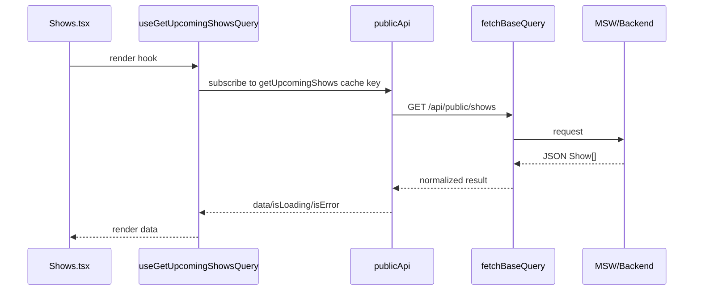

# RTK Query and `pyxis-types` Migration Guide

## Executive Summary

This document is a detailed handoff for migrating the Pyxis public-site frontend from its current data setup to an RTK Query setup, while creating a new shared `pyxis-types` workspace package for API/domain types.

The current codebase already has a clear split between:

- `pyxis-components`: reusable React components, Storybook stories, mocks, and shared visual fixtures.
- `pyxis-user-site`: the public web app, routes, page composition, and data fetching.

However, the data and type architecture is not yet aligned with the requested direction:

1. The app currently uses **TanStack React Query**, not RTK Query.
2. Public API types are duplicated between `pyxis-user-site` and `pyxis-components`.
3. MSW mock handlers live in `pyxis-components` and import local mock types.
4. Page Storybook stories in `pyxis-user-site` consume those mock handlers.

The migration should therefore happen in two coordinated tracks:

```text
Track A — shared types
  Create web/packages/pyxis-types.
  Move public API/domain types there.
  Update pyxis-components and pyxis-user-site to import from pyxis-types.

Track B — RTK Query
  Add Redux Toolkit + React Redux to pyxis-user-site.
  Create an RTK Query API slice for public endpoints.
  Replace current React Query hooks and provider.
  Keep Storybook/MSW working.
```

A new intern should treat this migration as an architecture refactor, not a visual-design task. The goal is to establish a stable data and type foundation before application-level page rewiring and page-level visual comparisons.

---

## 1. Terms and mental model

### 1.1 Workspace package

A workspace package is one package under the pnpm workspace:

```text
web/packages/<package-name>
```

The workspace root declares package discovery in:

```text
web/pnpm-workspace.yaml
```

Current workspace pattern:

```yaml
packages:
  - 'packages/*'
```

This means a new package placed under `web/packages/pyxis-types` will be picked up by pnpm automatically.

### 1.2 `pyxis-components`

`pyxis-components` is the UI component package. It should remain mostly presentation-only:

```text
web/packages/pyxis-components
```

It should contain:

- atoms,
- molecules,
- organisms,
- public-site components,
- tokens,
- Storybook stories,
- MSW handlers for component/page stories.

It should not own app routing or app API cache state.

### 1.3 `pyxis-user-site`

`pyxis-user-site` is the public application package:

```text
web/packages/pyxis-user-site
```

It owns:

- routes,
- pages,
- app shell,
- public API data fetching,
- app-level providers,
- page-level Storybook stories.

### 1.4 `pyxis-types`

`pyxis-types` is the proposed new package. It should contain shared domain/API contracts:

```text
web/packages/pyxis-types
```

It should contain no React components and no browser runtime logic. It should be safe to import from both components and app packages.

### 1.5 RTK Query

RTK Query is the data-fetching/cache layer built into Redux Toolkit. It replaces the current TanStack React Query hooks with generated hooks from an API slice.

The final shape should look like:

```text
pyxis-user-site/src/store.ts
pyxis-user-site/src/api/publicApi.ts
```

and page code should consume generated hooks like:

```ts
const { data, isLoading, isError } = useGetUpcomingShowsQuery();
const [submitBooking] = useSubmitBookingMutation();
```

---

## 2. Current-state architecture with evidence

This section maps the current implementation. The file and line references are based on repository inspection on 2026-04-24.

### 2.1 Workspace structure

The frontend workspace root has scripts for user-site and component package workflows:

```text
web/package.json
```

Evidence:

- `web/package.json:5-19` defines root scripts such as `dev`, `build`, `storybook`, `storybook:user-site`, `typecheck`, and recursive `test`/`lint`.
- `web/package.json:30` declares `pnpm@9.0.0`.
- `web/pnpm-workspace.yaml:1-2` includes all `packages/*` packages.

This is favorable for adding `pyxis-types` under `web/packages/pyxis-types`.

### 2.2 Current app dependencies use TanStack React Query

Current user-site dependencies:

```text
web/packages/pyxis-user-site/package.json
```

Evidence:

- `web/packages/pyxis-user-site/package.json:19-25` lists runtime dependencies.
- `web/packages/pyxis-user-site/package.json:20` includes `@tanstack/react-query`.
- `web/packages/pyxis-user-site/package.json:21` includes `@tanstack/react-query-devtools`.
- There is no `@reduxjs/toolkit` dependency in the current file.
- There is no `react-redux` dependency in the current file.

Conclusion: the codebase is not currently using RTK Query.

### 2.3 Current provider is `QueryClientProvider`

Current application provider setup:

```text
web/packages/pyxis-user-site/src/App.tsx
```

Evidence:

- `App.tsx:3` imports `QueryClient` and `QueryClientProvider` from `@tanstack/react-query`.
- `App.tsx:16-25` creates a `QueryClient` with default query options.
- `App.tsx:29-86` wraps the app in `<QueryClientProvider client={queryClient}>`.
- `App.tsx:31-83` defines browser routes inside the provider.

Conclusion: the migration must replace the provider and cache setup, not just hook imports.

### 2.4 Current data hooks are handwritten React Query hooks

Current hooks:

```text
web/packages/pyxis-user-site/src/api/hooks.ts
```

Evidence:

- `hooks.ts:14` imports `useQuery` and `useMutation` from `@tanstack/react-query`.
- `hooks.ts:21-26` defines shared React Query options.
- `hooks.ts:32-38` defines `useUpcomingShows`.
- `hooks.ts:44-50` defines `useShow`.
- `hooks.ts:57-63` defines `useArchive`.
- `hooks.ts:71-78` defines `useArchiveStats`.
- `hooks.ts:93-100` defines `useSubmitBooking`.

Conclusion: all public data hooks must be replaced or wrapped with RTK Query equivalents.

### 2.5 Current API client centralizes fetch/error handling

Current client:

```text
web/packages/pyxis-user-site/src/api/client.ts
```

Evidence:

- `client.ts:7` defines `API_BASE_URL` from `import.meta.env.VITE_API_URL`, defaulting to `http://localhost:8080`.
- `client.ts:16-25` defines `ApiException`.
- `client.ts:28-67` defines `apiFetch<T>()`.
- `client.ts:42-59` turns non-OK responses into `ApiException` with API error shape.
- `client.ts:61-64` handles `204 No Content`.

Conclusion: RTK Query must preserve equivalent base URL behavior and error normalization, or pages may regress in loading/error states.

### 2.6 Current endpoint paths are centralized

Current endpoints:

```text
web/packages/pyxis-user-site/src/api/endpoints.ts
```

Evidence:

- `endpoints.ts:5-13` exports public endpoint constants and functions.
- `endpoints.ts:7` defines `/api/public/shows`.
- `endpoints.ts:8` defines `/api/public/shows/:id`.
- `endpoints.ts:9` defines `/api/public/shows/:id/flyer`.
- `endpoints.ts:10` defines `/api/public/archive`.
- `endpoints.ts:11` defines `/api/public/archive/stats`.
- `endpoints.ts:12` defines `/api/public/submissions`.

Conclusion: these endpoint constants can either be reused by RTK Query or folded into the RTK Query API slice.

### 2.7 Public API types are duplicated

Current app types:

```text
web/packages/pyxis-user-site/src/api/types.ts
```

Current component mock types:

```text
web/packages/pyxis-components/src/mocks/types.ts
```

Evidence:

- `pyxis-user-site/src/api/types.ts:8-25` defines `Show`.
- `pyxis-components/src/mocks/types.ts:7-24` defines another `Show` with the same fields.
- `pyxis-user-site/src/api/types.ts:27-33` defines `ArchivedShow`.
- `pyxis-components/src/mocks/types.ts:26-32` defines another `ArchivedShow`.
- `pyxis-user-site/src/api/types.ts:35-40` defines `LineupEntry`.
- `pyxis-components/src/mocks/types.ts:34-39` defines another `LineupEntry`.
- `pyxis-user-site/src/api/types.ts:48-53` defines `ArchiveStats`.
- `pyxis-components/src/mocks/types.ts:76-81` defines another `ArchiveStats`.
- `pyxis-user-site/src/api/types.ts:57-70` defines booking request/confirmation types.
- `pyxis-components/src/mocks/types.ts:85-98` defines the same booking request/confirmation types.

Conclusion: `pyxis-types` should remove this duplication.

### 2.8 Component mocks and Storybook use mock handlers from `pyxis-components`

Current mock handlers:

```text
web/packages/pyxis-components/src/mocks/handlers.ts
```

Evidence:

- `handlers.ts:4` imports MSW helpers.
- `handlers.ts:5-11` imports local mock/API types.
- `handlers.ts:15-131` defines `seedShows`.
- `handlers.ts:133-146` defines `seedArchive`.
- `handlers.ts:148-153` defines `seedStats`.
- `handlers.ts:157-218+` defines MSW HTTP handlers.

Current user-site page stories:

```text
web/packages/pyxis-user-site/stories/PublicPages.stories.tsx
```

Evidence:

- `PublicPages.stories.tsx:3` imports `handlers` from `pyxis-components/mocks/handlers`.
- `PublicPages.stories.tsx:14-17` configures `msw: { handlers }`.
- `PublicPages.stories.tsx:45-56` renders page routes inside `MemoryRouter`.

Conclusion: the migration must keep MSW handlers compatible with the app's data layer.

---

## 3. Target architecture

The desired target is:

```text
web/
  packages/
    pyxis-types/
      src/
        public.ts
        index.ts
      package.json
      tsconfig.json
      tsconfig.build.json

    pyxis-components/
      src/
        public/
        mocks/
          handlers.ts   imports domain types from pyxis-types
          types.ts      optional compatibility re-export only

    pyxis-user-site/
      src/
        store.ts
        api/
          publicApi.ts  RTK Query API slice
          index.ts      exports generated hooks and types
        pages/
          Shows.tsx     uses RTK Query hooks
          ShowDetail.tsx
          Archive.tsx
          Book.tsx
```

The runtime dependency graph should be:

```text
pyxis-types
   ↑          ↑
   │          │
pyxis-components     pyxis-user-site
   ↑                         ↑
   │                         │
Storybook/MSW              React app + RTK Query
```

Important rule:

```text
pyxis-types must not import pyxis-components or pyxis-user-site.
pyxis-components must not import pyxis-user-site.
pyxis-user-site may import pyxis-components and pyxis-types.
```

---

## 4. Proposed `pyxis-types` package

### 4.1 Purpose

`pyxis-types` centralizes API/domain contracts used by both the UI component package and the public app.

It should answer questions like:

- What is a `Show`?
- What is a `LineupEntry`?
- What payload does the booking form submit?
- What does the archive endpoint return?
- What does a public API error look like?

### 4.2 Initial files

Create:

```text
web/packages/pyxis-types/package.json
web/packages/pyxis-types/tsconfig.json
web/packages/pyxis-types/tsconfig.build.json
web/packages/pyxis-types/src/index.ts
web/packages/pyxis-types/src/public.ts
```

### 4.3 `package.json` sketch

```json
{
  "name": "pyxis-types",
  "version": "0.1.0",
  "private": true,
  "type": "module",
  "main": "./dist/index.js",
  "types": "./dist/index.d.ts",
  "exports": {
    ".": {
      "import": "./dist/index.js",
      "types": "./dist/index.d.ts"
    },
    "./public": {
      "import": "./dist/public.js",
      "types": "./dist/public.d.ts"
    }
  },
  "files": ["dist"],
  "scripts": {
    "build": "tsc -p tsconfig.build.json",
    "typecheck": "tsc --noEmit -p tsconfig.json",
    "clean": "rm -rf dist"
  },
  "devDependencies": {
    "typescript": "^5.4.0"
  }
}
```

If workspace dependency hoisting already provides TypeScript, the devDependency can be omitted, but keeping it explicit is easier for interns.

### 4.4 `src/public.ts` sketch

```ts
// web/packages/pyxis-types/src/public.ts

export interface Show {
  id: number;
  artist: string;
  date: string;
  doors_time: string;
  start_time?: string;
  age: AgeRestriction;
  price: string;
  genre: string;
  description?: string;
  lineup?: LineupEntry[];
  flyer_url?: string;
  status: ShowStatus;
  submission_id?: number;
  artist_id?: number;
  created_at: string;
  updated_at: string;
}

export interface ArchivedShow {
  id: number;
  artist: string;
  date: string;
  genre: string;
  draw: number;
}

export interface LineupEntry {
  artist: string;
  role: 'headline' | 'support' | 'dj';
  start_time: string;
  end_time?: string;
}

export type ShowStatus = 'confirmed' | 'cancelled' | 'archived';
export type AgeRestriction = '21+' | '18+' | 'All Ages';

export interface ArchiveStats {
  total_shows: number;
  total_attendance: number;
  years_running: number;
  unique_artists: number;
}

export interface BookingFormData {
  artist_name: string;
  genre?: string;
  preferred_date?: string;
  expected_draw?: number;
  links: string;
  tech_rider?: string;
  message?: string;
}

export interface BookingConfirmation {
  success: boolean;
  submission_id?: number;
}

export interface ApiError {
  error: {
    code: string;
    message: string;
  };
}
```

### 4.5 `src/index.ts` sketch

```ts
export type {
  AgeRestriction,
  ApiError,
  ArchiveStats,
  ArchivedShow,
  BookingConfirmation,
  BookingFormData,
  LineupEntry,
  Show,
  ShowStatus,
} from './public';
```

### 4.6 Compatibility re-exports

To reduce churn, keep temporary compatibility files:

```ts
// web/packages/pyxis-user-site/src/api/types.ts
export type {
  AgeRestriction,
  ApiError,
  ArchiveStats,
  ArchivedShow,
  BookingConfirmation,
  BookingFormData,
  LineupEntry,
  Show,
  ShowStatus,
} from 'pyxis-types';
```

```ts
// web/packages/pyxis-components/src/mocks/types.ts
export type {
  AgeRestriction,
  ApiError,
  ArchiveStats,
  ArchivedShow,
  BookingConfirmation,
  BookingFormData,
  LineupEntry,
  Show,
  ShowStatus,
} from 'pyxis-types';

// Only keep Artist/Submission here if those are mock-only admin concepts.
```

This lets code continue compiling while imports are migrated gradually.

---

## 5. Proposed RTK Query architecture

### 5.1 New dependencies

Add to `web/packages/pyxis-user-site/package.json`:

```json
{
  "dependencies": {
    "@reduxjs/toolkit": "^2.x",
    "react-redux": "^9.x"
  }
}
```

During migration, do not immediately remove TanStack React Query. Remove it only after `rg` confirms there are no imports.

### 5.2 Store file

Create:

```text
web/packages/pyxis-user-site/src/store.ts
```

Sketch:

```ts
import { configureStore } from '@reduxjs/toolkit';
import { setupListeners } from '@reduxjs/toolkit/query';
import { publicApi } from './api/publicApi';

export const store = configureStore({
  reducer: {
    [publicApi.reducerPath]: publicApi.reducer,
  },
  middleware: (getDefaultMiddleware) =>
    getDefaultMiddleware().concat(publicApi.middleware),
});

setupListeners(store.dispatch);

export type RootState = ReturnType<typeof store.getState>;
export type AppDispatch = typeof store.dispatch;
```

Optional typed hooks:

```ts
import { TypedUseSelectorHook, useDispatch, useSelector } from 'react-redux';
import type { RootState, AppDispatch } from './store';

export const useAppDispatch = () => useDispatch<AppDispatch>();
export const useAppSelector: TypedUseSelectorHook<RootState> = useSelector;
```

### 5.3 API slice

Create:

```text
web/packages/pyxis-user-site/src/api/publicApi.ts
```

Sketch:

```ts
import { createApi, fetchBaseQuery } from '@reduxjs/toolkit/query/react';
import type {
  ArchiveStats,
  ArchivedShow,
  BookingConfirmation,
  BookingFormData,
  Show,
} from 'pyxis-types';

const API_BASE_URL = import.meta.env.VITE_API_URL ?? 'http://localhost:8080';

export const publicApi = createApi({
  reducerPath: 'publicApi',
  baseQuery: fetchBaseQuery({
    baseUrl: API_BASE_URL,
    prepareHeaders: (headers) => {
      headers.set('Content-Type', 'application/json');
      return headers;
    },
  }),
  tagTypes: ['Show', 'Archive', 'Submission'],
  endpoints: (builder) => ({
    getUpcomingShows: builder.query<Show[], void>({
      query: () => '/api/public/shows',
      providesTags: (result) =>
        result
          ? [
              ...result.map((show) => ({ type: 'Show' as const, id: show.id })),
              { type: 'Show' as const, id: 'LIST' },
            ]
          : [{ type: 'Show' as const, id: 'LIST' }],
    }),

    getShow: builder.query<Show, number>({
      query: (id) => `/api/public/shows/${id}`,
      providesTags: (_result, _error, id) => [{ type: 'Show', id }],
    }),

    getArchive: builder.query<ArchivedShow[], string | void>({
      query: (search) => ({
        url: '/api/public/archive',
        params: search ? { search } : undefined,
      }),
      providesTags: [{ type: 'Archive', id: 'LIST' }],
    }),

    getArchiveStats: builder.query<ArchiveStats, void>({
      query: () => '/api/public/archive/stats',
      providesTags: [{ type: 'Archive', id: 'STATS' }],
      keepUnusedDataFor: 3600,
    }),

    submitBooking: builder.mutation<BookingConfirmation, BookingFormData>({
      query: (body) => ({
        url: '/api/public/submissions',
        method: 'POST',
        body,
      }),
      invalidatesTags: [{ type: 'Submission', id: 'LIST' }],
    }),
  }),
});

export const {
  useGetUpcomingShowsQuery,
  useGetShowQuery,
  useGetArchiveQuery,
  useGetArchiveStatsQuery,
  useSubmitBookingMutation,
} = publicApi;
```

### 5.4 App provider migration

Current `App.tsx` uses:

```tsx
<QueryClientProvider client={queryClient}>...</QueryClientProvider>
```

Target:

```tsx
import { Provider } from 'react-redux';
import { store } from './store';

export function App() {
  return (
    <Provider store={store}>
      <ErrorBoundary>
        <BrowserRouter>
          {/* routes */}
        </BrowserRouter>
      </ErrorBoundary>
    </Provider>
  );
}
```

Remove:

```ts
QueryClient
QueryClientProvider
queryClient
```

only after the RTK store is working.

---

## 6. Hook migration strategy

There are two safe strategies.

### 6.1 Strategy A: direct migration

Change every page to import generated RTK Query hooks directly.

Example before:

```ts
import { useUpcomingShows } from '../api/hooks';

const { data: shows, isLoading, isError, error } = useUpcomingShows();
```

After:

```ts
import { useGetUpcomingShowsQuery } from '../api/publicApi';

const { data: shows, isLoading, isError, error } = useGetUpcomingShowsQuery();
```

This is simple but touches all pages at once.

### 6.2 Strategy B: compatibility wrappers

Keep current hook names while changing internals.

```ts
// web/packages/pyxis-user-site/src/api/hooks.ts
export {
  useGetUpcomingShowsQuery as useUpcomingShows,
  useGetArchiveStatsQuery as useArchiveStats,
} from './publicApi';

export function useShow(id: number | undefined) {
  return useGetShowQuery(id!, { skip: id === undefined });
}

export function useArchive(search?: string) {
  return useGetArchiveQuery(search);
}

export function useSubmitBooking() {
  const [mutate, result] = useSubmitBookingMutation();
  return {
    ...result,
    mutateAsync: mutate,
  };
}
```

This reduces page churn but can hide RTK Query semantics. For an intern, direct migration may be clearer if tests are easy to run. Compatibility wrappers are safer if page rewiring is happening concurrently.

Recommendation:

```text
Use compatibility wrappers for the first commit, then optionally migrate pages to generated hook names in a second commit.
```

---

## 7. Storybook and MSW migration notes

The user-site page stories currently rely on MSW handlers from `pyxis-components`:

```ts
import { handlers } from 'pyxis-components/mocks/handlers';
```

This is good because RTK Query uses `fetch` under the hood and MSW can still intercept the same `/api/public/*` requests.

### 7.1 What must be added

User-site Storybook needs the Redux provider just like the real app. There are two options:

#### Option A: wrap inside story component

Update `PublicPages.stories.tsx`:

```tsx
import { Provider } from 'react-redux';
import { store } from '../src/store';

function PublicPageRoute(...) {
  return (
    <Provider store={store}>
      <MemoryRouter initialEntries={[route]}>
        ...
      </MemoryRouter>
    </Provider>
  );
}
```

#### Option B: global decorator

Add a Storybook preview decorator:

```tsx
// web/packages/pyxis-user-site/.storybook/preview.tsx
import { Provider } from 'react-redux';
import { store } from '../src/store';

export const decorators = [
  (Story) => (
    <Provider store={store}>
      <Story />
    </Provider>
  ),
];
```

Recommendation:

```text
Use a global decorator if all stories need data; use local wrapper if only page stories need it.
```

### 7.2 Store isolation in Storybook

A single global Redux store can leak cache between stories. For simple page stories this may be okay, but safer Storybook architecture creates a new store per story.

Preferred pattern:

```ts
export function makeStore() {
  return configureStore({ ... });
}
```

Then:

```tsx
const store = makeStore();
return <Provider store={store}><Story /></Provider>;
```

This is an improvement but not required for the first migration.

---

## 8. API error handling

Current `apiFetch` throws `ApiException` with:

```ts
code
message
status
```

RTK Query returns errors differently. A typical `fetchBaseQuery` error has shape:

```ts
{
  status: number | 'FETCH_ERROR' | 'PARSING_ERROR' | 'CUSTOM_ERROR';
  data?: unknown;
}
```

Pages currently may assume an `Error` instance in some places. For example, `ShowsError` checks:

```ts
error instanceof Error ? error.message : 'Unknown error'
```

RTK Query errors will not necessarily satisfy that.

Add a helper:

```ts
// web/packages/pyxis-user-site/src/api/errors.ts
import type { FetchBaseQueryError } from '@reduxjs/toolkit/query';

export function getApiErrorMessage(error: unknown): string {
  if (!error) return 'Unknown error';
  if (error instanceof Error) return error.message;

  const maybe = error as FetchBaseQueryError;
  if (typeof maybe.status !== 'undefined') {
    const data = maybe.data as { error?: { message?: string } } | undefined;
    return data?.error?.message ?? `Request failed: ${String(maybe.status)}`;
  }

  return 'Unknown error';
}
```

Then pages can use:

```tsx
<p>{getApiErrorMessage(error)}</p>
```

---

## 9. File-by-file implementation plan

### Phase 1: `pyxis-types`

Create:

```text
web/packages/pyxis-types/package.json
web/packages/pyxis-types/tsconfig.json
web/packages/pyxis-types/tsconfig.build.json
web/packages/pyxis-types/src/public.ts
web/packages/pyxis-types/src/index.ts
```

Then update dependencies:

```json
// web/packages/pyxis-components/package.json
"dependencies": {
  "clsx": "^2.1.0",
  "pyxis-types": "workspace:*"
}
```

```json
// web/packages/pyxis-user-site/package.json
"dependencies": {
  "pyxis-types": "workspace:*"
}
```

### Phase 2: type imports

Update these files first:

```text
web/packages/pyxis-components/src/mocks/types.ts
web/packages/pyxis-components/src/mocks/handlers.ts
web/packages/pyxis-user-site/src/api/types.ts
```

Then update component files that import from `../../mocks/types`, such as:

```text
web/packages/pyxis-components/src/public/PubHero/PubHero.tsx
web/packages/pyxis-components/src/public/PubShowRow/PubShowRow.tsx
web/packages/pyxis-components/src/public/TicketStub/TicketStub.tsx
web/packages/pyxis-components/src/public/LineupRow/LineupRow.tsx
web/packages/pyxis-components/src/public/ArchiveStats/ArchiveStats.tsx
web/packages/pyxis-components/src/public/BookingForm/BookingForm.tsx
```

Use:

```ts
import type { Show } from 'pyxis-types';
```

or:

```ts
import type { Show } from 'pyxis-types/public';
```

depending on which export style is chosen.

### Phase 3: RTK Query package dependencies

Update:

```text
web/packages/pyxis-user-site/package.json
```

Add:

```text
@reduxjs/toolkit
react-redux
```

Keep `@tanstack/react-query` temporarily.

Run:

```bash
cd web
pnpm install
```

### Phase 4: store and API slice

Create:

```text
web/packages/pyxis-user-site/src/store.ts
web/packages/pyxis-user-site/src/api/publicApi.ts
web/packages/pyxis-user-site/src/api/errors.ts
```

### Phase 5: provider migration

Update:

```text
web/packages/pyxis-user-site/src/App.tsx
```

Remove QueryClient setup after store is wired.

### Phase 6: hook migration

Update or replace:

```text
web/packages/pyxis-user-site/src/api/hooks.ts
```

Then update pages if not using compatibility wrappers:

```text
web/packages/pyxis-user-site/src/pages/Shows.tsx
web/packages/pyxis-user-site/src/pages/ShowDetail.tsx
web/packages/pyxis-user-site/src/pages/Archive.tsx
web/packages/pyxis-user-site/src/pages/Book.tsx
web/packages/pyxis-user-site/src/pages/BookSuccess.tsx
```

### Phase 7: Storybook provider

Update:

```text
web/packages/pyxis-user-site/stories/PublicPages.stories.tsx
```

or the user-site Storybook preview config.

### Phase 8: cleanup

Search:

```bash
rg "@tanstack|QueryClient|QueryClientProvider|useQuery|useMutation|apiFetch|ApiException" web/packages/pyxis-user-site
```

Expected end state:

- no TanStack imports,
- no QueryClient provider,
- no handwritten query hooks unless retained as wrappers over RTK Query,
- no duplicated public API type definitions.

---

## 10. Suggested commit plan

Keep commits small. Recommended sequence:

### Commit 1: add `pyxis-types`

```text
Add shared pyxis-types package
```

Contains only new package and no import migration.

### Commit 2: migrate shared types

```text
Use pyxis-types for public API contracts
```

Updates components, mocks, and user-site type imports.

### Commit 3: add RTK Query infrastructure

```text
Add RTK Query public API slice
```

Adds dependencies, store, API slice, and error helper.

### Commit 4: migrate provider and hooks

```text
Migrate public site from React Query to RTK Query
```

Updates `App.tsx`, hooks, and pages.

### Commit 5: Storybook/test cleanup

```text
Wire RTK Query provider into public page stories
```

Updates Storybook provider and MSW integration if needed.

### Commit 6: remove TanStack Query

```text
Remove React Query from public site
```

Only after verification.

---

## 11. Validation checklist

Run after each major phase:

```bash
cd web
pnpm --filter pyxis-types typecheck
pnpm --filter pyxis-components typecheck
pnpm --filter pyxis-user-site typecheck
pnpm -r typecheck
```

If tests exist and are stable:

```bash
cd web
pnpm -r test
```

Storybook checks:

```bash
cd web
pnpm --filter pyxis-components storybook
pnpm --filter pyxis-user-site storybook
```

Search checks:

```bash
rg "@tanstack|QueryClient|QueryClientProvider|useQuery|useMutation" web/packages/pyxis-user-site
rg "src/api/types|mocks/types" web/packages -g'*.ts' -g'*.tsx'
rg "pyxis-types" web/packages -g'*.ts' -g'*.tsx' -g'package.json'
```

Expected final state:

```text
pyxis-types provides shared types.
pyxis-components imports shared types for components and mocks.
pyxis-user-site imports shared types and RTK Query hooks.
TanStack React Query is absent unless intentionally retained.
User-site Storybook pages still load data through MSW.
```

---

## 12. Risks and mitigations

### Risk: RTK Query error objects break existing error UI

Mitigation:

- Add `getApiErrorMessage(error)` helper.
- Update error components to use it.

### Risk: Storybook cache leakage between stories

Mitigation:

- Prefer `makeStore()` and per-story provider if stories show stale data.

### Risk: Type package introduces circular dependency

Mitigation:

- Keep `pyxis-types` dependency-free.
- Do not import UI packages from it.

### Risk: Duplicate compatibility files hide drift

Mitigation:

- Keep compatibility re-exports only temporarily.
- Add a task to remove duplicated local definitions.

### Risk: API contract is still informal

Mitigation:

- Treat `pyxis-types` as a central hand-written contract for now.
- Later consider schema generation from OpenAPI/protobuf/zod.

---

## 13. Mermaid diagrams

### 13.1 Current state

```mermaid
flowchart TD
  App[pyxis-user-site App.tsx] --> QCP[QueryClientProvider]
  QCP --> Pages[Public pages]
  Pages --> Hooks[src/api/hooks.ts]
  Hooks --> ReactQuery[TanStack React Query]
  Hooks --> ApiFetch[src/api/client.ts]
  ApiFetch --> Backend[/api/public/*]

  Components[pyxis-components] --> MockTypes[src/mocks/types.ts]
  Handlers[src/mocks/handlers.ts] --> MockTypes
  PageStories[pyxis-user-site stories] --> Handlers
  UserTypes[pyxis-user-site src/api/types.ts] -. duplicated .- MockTypes
```

### 13.2 Target state

```mermaid
flowchart TD
  Types[pyxis-types] --> Components[pyxis-components]
  Types --> UserSite[pyxis-user-site]

  UserSite --> Provider[Redux Provider]
  Provider --> Store[src/store.ts]
  Store --> PublicApi[src/api/publicApi.ts]
  PublicApi --> Backend[/api/public/*]

  Components --> Handlers[MSW handlers]
  Handlers --> Types
  PageStories[Public page Storybook] --> Provider
  PageStories --> Handlers
```

### 13.3 Request flow after migration



---

## 14. Intern orientation: how to start

If you are the intern implementing this:

1. Read this document once fully.
2. Read these files in order:

```text
web/package.json
web/pnpm-workspace.yaml
web/packages/pyxis-user-site/package.json
web/packages/pyxis-user-site/src/App.tsx
web/packages/pyxis-user-site/src/api/hooks.ts
web/packages/pyxis-user-site/src/api/client.ts
web/packages/pyxis-user-site/src/api/endpoints.ts
web/packages/pyxis-user-site/src/api/types.ts
web/packages/pyxis-components/src/mocks/types.ts
web/packages/pyxis-components/src/mocks/handlers.ts
web/packages/pyxis-user-site/stories/PublicPages.stories.tsx
```

3. Run baseline typecheck:

```bash
cd web
pnpm -r typecheck
```

4. Implement Phase 1 only.
5. Commit.
6. Implement Phase 2 only.
7. Commit.
8. Continue phase by phase.

Do not combine the type migration and RTK Query migration in one commit. If something breaks, small commits make it easy to bisect and review.

---

## 15. References

Key evidence files:

```text
web/package.json
web/pnpm-workspace.yaml
web/packages/pyxis-user-site/package.json
web/packages/pyxis-user-site/src/App.tsx
web/packages/pyxis-user-site/src/api/hooks.ts
web/packages/pyxis-user-site/src/api/client.ts
web/packages/pyxis-user-site/src/api/endpoints.ts
web/packages/pyxis-user-site/src/api/types.ts
web/packages/pyxis-components/package.json
web/packages/pyxis-components/src/mocks/types.ts
web/packages/pyxis-components/src/mocks/handlers.ts
web/packages/pyxis-user-site/stories/PublicPages.stories.tsx
```

Related prior assessment:

```text
ttmp/2026/04/24/PYXIS-COMPONENT-VISUAL-PARITY--run-bottom-up-component-visual-parity-comparisons/reference/05-react-modular-rtk-query-themable-foundation-assessment.md
```
