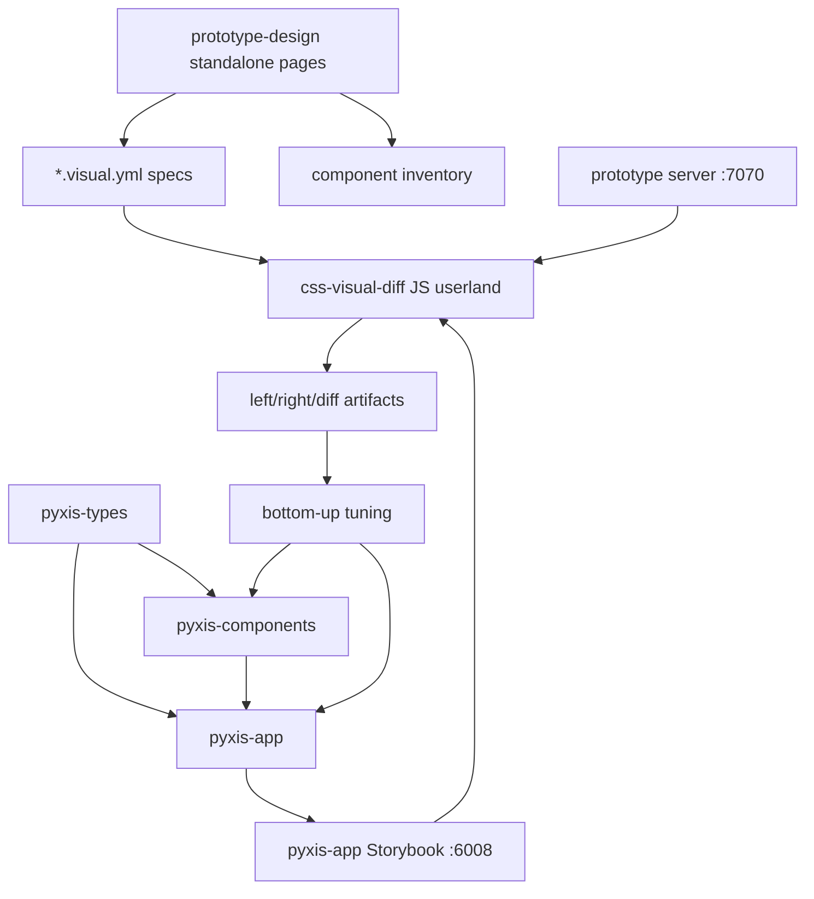
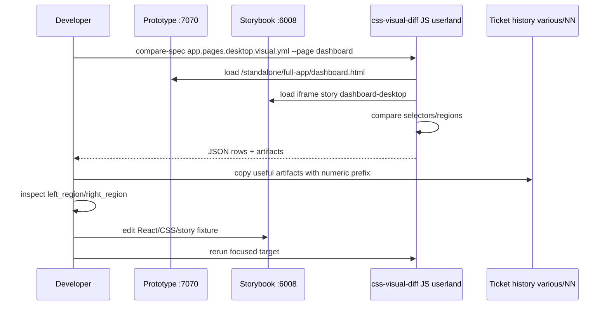

# Pyxis App React End-to-End Workflow Guide

## Executive summary

This guide describes how to transform the Pyxis staff/full-app desktop prototype and the mobile prototype baseline into one production-quality, responsive React package named `pyxis-app`.

The target workflow is:

```text
prototype standalone pages
  → inventory screens and component candidates
  → create pyxis-app package
  → define app data contracts and RTK Query API slices
  → decompose screens into atoms/molecules/organisms/pages
  → write Storybook stories for every layer
  → write JS/YAML visual suite specs
  → iterate bottom-up with css-visual-diff
  → compose full pages
  → iterate page-level visual parity
  → document accepted differences and playbook lessons
```

The important architectural decision is that visual comparison should remain **JS/spec canonical**, reusing the current project-specific `css-visual-diff` userland instead of reviving old native `*.css-visual-diff.yml` configs.

The existing public-site work proved the pattern:

- React package with modular components and stories,
- stable `data-pyxis-component` / `data-pyxis-part` selectors,
- page-level `data-page` / `data-section` selectors,
- Storybook stories served live,
- standalone prototype pages served from `prototype-design/`,
- visual suite specs under `prototype-design/visual-diff/userland/specs/`,
- `css-visual-diff verbs --repository prototype-design/visual-diff/userland pyxis pages compare-spec ...`.

### Responsive-app decision

The mobile prototype is a **responsive baseline for the main app**, not a separate application architecture. That means:

- create one `pyxis-app` package,
- create one route/page hierarchy,
- create one data and RTK Query layer,
- make components and pages responsive through CSS, layout variants, and shell variants,
- compare desktop pages against `prototype-design/standalone/full-app/*.html`,
- compare mobile viewport variants of those same React pages against `prototype-design/standalone/mobile/*.html`.

Mobile-specific components are allowed only as implementation details of the same app shell or page when the interaction truly differs, for example a bottom navigation replacing the desktop sidebar. They should not create a parallel `MobileDashboardPage`, `MobileShowsPage`, etc. unless sharing the page would make the implementation worse.

For `pyxis-app`, we should reuse that shape and extend it to the staff app across desktop and mobile viewport variants. The mobile prototype is not a second product; it is the responsive/mobile form of the same app routes and component system.

---

## 1. Current system map

### 1.1 Repository areas that matter

```text
prototype-design/
  lib/
    tokens.js
    data.js
    components.jsx
  screens/
    auth-dash.jsx
    shows-bookings.jsx
    roster.jsx
    settings-discord.jsx
    mobile.jsx
    system.jsx
    ppxis.jsx
  standalone/
    full-app/
      index.html
      login.html
      setup.html
      dashboard.html
      shows.html
      calendar.html
      bookings.html
      modal.html
      artists.html
      attendance.html
      log.html
      discord.html
      settings.html
    mobile/
      index.html
      login.html
      home.html
      shows.html
      show-detail.html
      calendar.html
      bookings.html
      booking-review.html
      artists.html
      artist-detail.html
      post-show.html
      settings.html
  visual-diff/
    scripts/fixtures/
    userland/
      lib/
      specs/
      verbs/
      scripts/

web/
  packages/
    pyxis-types/
    pyxis-components/
    pyxis-user-site/
    pyxis-app/           # new package to create
```

The standalone full-app and mobile index pages already exist:

```text
prototype-design/standalone/full-app/index.html
prototype-design/standalone/mobile/index.html
```

They are clean indexes over the per-screen standalone prototype pages. That means the first implementation phase does **not** need to recreate the standalone HTML infrastructure from scratch. Instead, it should validate the existing pages, add missing stable selectors where necessary, and create React counterparts.

### 1.2 Prototype screen sources

The staff/full-app prototype pages are composed from these files:

```text
prototype-design/screens/auth-dash.jsx
  LoginScreen
  SetupScreen
  DashboardScreen

prototype-design/screens/shows-bookings.jsx
  ShowsScreen
  BookingsScreen
  AuditLogScreen

prototype-design/screens/roster.jsx
  ArtistsScreen
  CalendarScreen
  AttendanceScreen

prototype-design/screens/settings-discord.jsx
  DiscordScreen
  SettingsScreen
  ModalShowcase
```

The mobile prototype baseline comes from:

```text
prototype-design/screens/mobile.jsx
```

Treat those mobile pages as viewport-specific design evidence for the same app routes. They are not a separate `pyxis-mobile` product and should not drive a second React page hierarchy unless a concrete interaction truly cannot share the main page/component implementation.

Shared prototype support lives in:

```text
prototype-design/lib/tokens.js
prototype-design/lib/data.js
prototype-design/lib/components.jsx
```

Those files are not production code. They are visual specification material. Treat them as a reference for:

- layout,
- spacing,
- color,
- typography,
- component vocabulary,
- state examples,
- fake data shape,
- interaction intent.

Do **not** copy prototype JSX verbatim into the React package unless you are intentionally making a temporary fixture. The target is a maintainable typed React package, not a direct Babel prototype transplant.

### 1.3 Current web packages

Current packages:

```text
web/packages/pyxis-types
web/packages/pyxis-components
web/packages/pyxis-user-site
```

`pyxis-types` is a dependency-free shared contract package. It currently contains public-site API/domain contracts. `pyxis-app` should either extend this package with staff-app contracts or add new files such as:

```text
web/packages/pyxis-types/src/app.ts
web/packages/pyxis-types/src/public.ts
web/packages/pyxis-types/src/index.ts
```

Keep `pyxis-types` dependency-free. It should not import React, Redux, components, or app packages.

`pyxis-components` is the shared component library. It contains generic atoms/molecules/organisms and public-site domain components. New truly-generic primitives should go here. Staff-app-specific components should start in `pyxis-app` unless we know they are reusable.

`pyxis-user-site` is a consumer app package. It is useful as a model because it already uses:

- React Router,
- Redux Provider,
- RTK Query,
- MSW-backed Storybook,
- source aliasing to avoid stale `pyxis-components/dist`,
- page stories for visual comparison.

### 1.4 Current visual-diff userland

Active visual workflow:

```text
prototype-design/visual-diff/userland/
  README.md
  lib/
    registry.js
    compare-region.js
    inspect.js
    snapshot.js
    policies.js
    markdown.js
    artifacts.js
    normalizers.js
    storybook.js
  specs/
    public-pages.desktop.visual.yml
    public-pages.desktop.visual.js
  verbs/
    pyxis-pages.js
  scripts/
    refresh-spec-mirrors.py
    run-compare-spec-public-pages.sh
    smoke-list-targets.sh
    ...
```

Canonical spec shape:

```yaml
schemaVersion: pyxis.visual-suite.v1
name: public-pages
defaults:
  prototypeBase: http://localhost:7070
  storybookBase: http://localhost:6007
  viewport:
    width: 920
    height: 1460
  waitMs: 1000
  threshold: 30
  inspect: rich
  variant: desktop
policy:
  bands:
    - name: accepted
      maxChangedPercent: 0.5
    - name: review
      maxChangedPercent: 10
    - name: tune-required
      maxChangedPercent: 30
    - name: major-mismatch
      maxChangedPercent: 100
acceptedDifferences: {}
targets:
  - page: shows
    variant: desktop
    priority: tune-first
    prototypePath: /standalone/public/shows.html
    storyId: public-site-pages--shows-desktop
    baselineDiffs: {}
    sections:
      - name: page
        original: '#root'
        react: '[data-story-frame="pyxis-page-shell"]'
```

The `compare-spec` verb can already consume arbitrary YAML/JSON visual specs through `objectFromFile`. That is the strongest reuse point for `pyxis-app`.

---

## 2. Target package architecture

### 2.1 Package name and responsibility

Create:

```text
web/packages/pyxis-app/
```

Responsibility:

- Staff/full-app React UI.
- Responsive/mobile views of the same staff/full-app React UI.
- App-specific domain components.
- App-specific RTK Query API slices.
- App routes and page composition.
- Storybook stories for components and pages.
- Visual-diff page fixtures/stories.

It should consume:

```text
pyxis-components
pyxis-types
react
react-dom
react-router-dom
@reduxjs/toolkit
react-redux
```

It should not become a dumping ground for all components. Use this rule:

```text
If the component is generic and reusable across public site + app, put it in pyxis-components.
If the component encodes Pyxis staff-app concepts, put it in pyxis-app; implement mobile behavior as responsive variants unless there is a concrete mobile-only interaction pattern.
If a pyxis-app component later proves reusable, promote it to pyxis-components deliberately.
```

### 2.2 Suggested package layout

```text
web/packages/pyxis-app/
  package.json
  vite.config.ts
  tsconfig.json
  tsconfig.build.json
  index.html
  public/
    mockServiceWorker.js
  .storybook/
    main.ts
    preview.tsx
  src/
    index.ts
    main.tsx
    App.tsx
    store.ts
    api/
      appApi.ts
      endpoints.ts
      hooks.ts
      errors.ts
      mockHandlers.ts
    styles/
      global.css
      app-tokens.css          # app-local aliases over pyxis-components tokens if needed
    components/
      atoms/
      molecules/
      organisms/
      shell/
    pages/
      Login.tsx
      Setup.tsx
      Dashboard.tsx
      Shows.tsx
      ShowDetail.tsx
      Calendar.tsx
      Bookings.tsx
      BookingReview.tsx
      Artists.tsx
      ArtistDetail.tsx
      Attendance.tsx
      PostShow.tsx
      AuditLog.tsx
      Discord.tsx
      Settings.tsx
    stories/
      AppPages.stories.tsx       # desktop + mobile viewport variants of the same page components
```

Alternative: put stories beside components with `*.stories.tsx`, and keep only route/page stories in `stories/`. That is the current `pyxis-components` + `pyxis-user-site` pattern and is probably best:

```text
src/components/molecules/KpiCard/KpiCard.stories.tsx
src/components/organisms/BookingQueue/BookingQueue.stories.tsx
stories/AppPages.stories.tsx
```

### 2.3 Package manifest sketch

```json
{
  "name": "pyxis-app",
  "version": "0.1.0",
  "private": true,
  "type": "module",
  "scripts": {
    "dev": "vite",
    "build": "tsc -b && vite build",
    "storybook": "storybook dev -p 6008",
    "build-storybook": "storybook build",
    "typecheck": "tsc --noEmit",
    "test": "vitest run",
    "lint": "eslint src --ext .ts,.tsx",
    "clean": "rm -rf dist storybook-static"
  },
  "dependencies": {
    "@reduxjs/toolkit": "^2.11.2",
    "pyxis-components": "workspace:*",
    "pyxis-types": "workspace:*",
    "react": "^18.2.0",
    "react-dom": "^18.2.0",
    "react-redux": "^9.2.0",
    "react-router-dom": "^6.22.0"
  },
  "devDependencies": {
    "@storybook/react": "^8.0.0",
    "@storybook/react-vite": "^8.0.0",
    "@storybook/addon-essentials": "^8.0.0",
    "@storybook/addon-a11y": "^8.0.0",
    "msw": "^2.3.0",
    "msw-storybook-addon": "^2.0.0",
    "typescript": "^5.4.0",
    "vite": "^5.2.0",
    "vitest": "^1.5.0"
  }
}
```

Suggested Storybook port:

```text
pyxis-components Storybook: 6006
pyxis-user-site Storybook: 6007
pyxis-app Storybook: 6008
prototype server: 7070
```

### 2.4 Workspace wiring

`web/pnpm-workspace.yaml` already includes:

```yaml
packages:
  - 'packages/*'
```

So a new `packages/pyxis-app` package is automatically included.

Update `web/tsconfig.json` paths if you want a source alias:

```json
"paths": {
  "@pyxis-components": ["./packages/pyxis-components/src"],
  "@pyxis-components/*": ["./packages/pyxis-components/src/*"],
  "@pyxis-app": ["./packages/pyxis-app/src"],
  "@pyxis-app/*": ["./packages/pyxis-app/src/*"],
  "@/*": ["./packages/pyxis-user-site/src/*"]
}
```

Storybook should alias `pyxis-components` to source, like `pyxis-user-site` does, to avoid stale package `dist` during active work.

---

## 3. Taxonomy: how to decompose the app

### 3.1 Two-axis model

Use two axes:

```text
Composition level:
  atom → molecule → organism → page/screen

Domain:
  generic design system
  public site
  staff/full app
  viewport variant: desktop/mobile
```

This prevents arguments like “is `BookingQueue` an organism or a page?” The useful answer is:

```text
BookingQueue = staff-app organism
BookingsPage = staff-app page
BookingReview = staff-app page/section with a mobile viewport variant
```

### 3.2 What belongs in `pyxis-components`

Put or keep here:

```text
Generic atoms:
  Button
  Badge
  Tag
  Icon
  IconButton
  Input
  Select
  Textarea
  Avatar

Generic molecules:
  Card
  CardHead
  Field
  Stat
  Table
  Empty
  LogRow

Generic organisms:
  Modal
  TopBar
```

Promote from app to shared only when the app component is truly generic. For example:

- `SegmentedControl` might be generic.
- `DatePill` might be generic if public and staff both use it.
- `BookingStatusTimeline` is likely app-specific.
- `DiscordChannelMapping` is app-specific.

### 3.3 What belongs in `pyxis-app`

Staff/full-app component candidates:

```text
Atoms / small primitives:
  AppIconButton
  AppNavBadge
  StatusDot
  MoneyDelta
  CountPill
  DateChip

Molecules:
  MetricCard
  TodayShowCard
  ActivityFeedItem
  ShowTableRow
  BookingQueueRow
  ArtistRosterRow
  CalendarEventChip
  AttendanceStat
  DiscordChannelRow
  SettingsToggleRow

Organisms:
  AppShell
  AppSidebar
  AppTopBar
  DashboardOverview
  ShowsTable
  BookingQueue
  CalendarMonth
  ArtistRoster
  AttendancePanel
  AuditLogPanel
  DiscordMappingPanel
  SettingsPanel
  NewShowModal

Pages:
  LoginPage
  SetupPage
  DashboardPage
  ShowsPage
  CalendarPage
  BookingsPage
  ArtistsPage
  AttendancePage
  AuditLogPage
  DiscordPage
  SettingsPage
```

Responsive/mobile implementation candidates:

```text
Responsive variants, not separate products:
  AppShell collapses sidebar/topbar into mobile navigation.
  AppSidebar becomes a drawer or bottom navigation.
  AppTopBar becomes a compact mobile header.
  DashboardOverview reflows metric cards into a vertical stack.
  ShowsTable can become ShowCardList at narrow widths.
  BookingQueue can become BookingCardList at narrow widths.
  CalendarMonth can expose a compact agenda/list view at narrow widths.
  ArtistRoster can become ArtistList at narrow widths.
  SettingsPanel keeps the same data contract but uses mobile row spacing.
```

Create `Mobile*` components only when a mobile interaction is genuinely different and cannot be expressed as a responsive variant of the same component. Even then, treat the component as an implementation detail of the same route/page, not as a separate mobile app.

### 3.4 Decomposition rule of thumb

Use this decision tree:

```text
Is it a single primitive with no Pyxis domain meaning?
  → pyxis-components atom

Is it a generic composition of primitives?
  → pyxis-components molecule

Is it a generic interaction/shell pattern?
  → pyxis-components organism

Does it represent Pyxis staff-app domain data/workflow?
  → pyxis-app component, responsive across desktop/mobile as needed

Does it map to a route or full screen?
  → pyxis-app page/screen
```

Pseudocode:

```ts
function classify(component) {
  if (component.isPrimitive && !component.hasDomainMeaning) return 'pyxis-components/atom';
  if (component.isGenericComposition && !component.hasDomainMeaning) return 'pyxis-components/molecule';
  if (component.isGenericShellOrInteraction && !component.hasDomainMeaning) return 'pyxis-components/organism';
  if (component.isDomainWorkflow && !component.isRoute) return 'pyxis-app/component';
  if (component.isRoute || component.isFullScreen) return 'pyxis-app/page';
}
```

---

## 4. Selector and theming contracts

### 4.1 Component selector contract

Every reusable component root should expose:

```html
data-pyxis-component="component-slug"
data-pyxis-part="root"
```

Internal parts should expose:

```html
data-pyxis-component="component-slug"
data-pyxis-part="specific-part"
```

Use the existing helper from `pyxis-components` where available:

```ts
import { pyxisPart } from 'pyxis-components';
```

If `pyxisPart` is not exported in the right place, either export it intentionally from `pyxis-components` or mirror a tiny local helper in `pyxis-app` temporarily:

```ts
export function pyxisPart(component: string, part = 'root') {
  return {
    'data-pyxis-component': component,
    'data-pyxis-part': part,
  };
}
```

Example:

```tsx
export function MetricCard({ label, value, trend }: MetricCardProps) {
  return (
    <article className="pyxis-metric-card" {...pyxisPart('metric-card')}>
      <div {...pyxisPart('metric-card', 'label')}>{label}</div>
      <strong {...pyxisPart('metric-card', 'value')}>{value}</strong>
      {trend ? <span {...pyxisPart('metric-card', 'trend')}>{trend}</span> : null}
    </article>
  );
}
```

### 4.2 Page/screen selector contract

Every page or screen root should expose:

```html
data-page="dashboard"
data-section="dashboard-overview"
```

For mobile viewport comparisons, prefer the same `data-page` and `data-section` names as desktop. Only introduce a mobile-specific section slug when the interaction genuinely has no desktop counterpart:

```html
data-page="dashboard"
data-section="dashboard-summary"

<!-- only if genuinely mobile-only -->
data-section="dashboard-bottom-nav"
```

Recommended page selector pattern:

```tsx
<main className="pyxis-app-page pyxis-dashboard-page" data-page="dashboard">
  <section data-section="dashboard-hero">...</section>
  <section data-section="dashboard-metrics">...</section>
  <section data-section="dashboard-activity">...</section>
</main>
```

Do not rely on broad selectors such as:

```css
#root > *
#storybook-root > *
```

unless the broad region is intentionally the whole page shell.

### 4.3 CSS/theming contract

Use layered CSS:

```text
1. global tokens from pyxis-components
2. app-level CSS variables
3. component-local CSS variables
4. consumer/theme overrides
```

Example component CSS:

```css
:where([data-pyxis-component='metric-card'][data-pyxis-part='root']) {
  --pyxis-metric-card-bg: var(--color-surface);
  --pyxis-metric-card-border: var(--color-border-subtle);
  --pyxis-metric-card-value-color: var(--color-text-primary);

  background: var(--pyxis-metric-card-bg);
  border: 1px solid var(--pyxis-metric-card-border);
  border-radius: var(--radius-lg);
  padding: var(--space-5);
}

:where([data-pyxis-component='metric-card'][data-pyxis-part='value']) {
  color: var(--pyxis-metric-card-value-color);
  font-family: var(--font-display);
}
```

Do not hide important styling in inline `style={{ ... }}` unless it is truly dynamic. Static prototype values should move into CSS files.

---

## 5. RTK Query and data contracts

### 5.1 Why schema-first matters

Pages should not invent shapes ad hoc. The app will need shared contracts for:

```text
Show
Booking
Artist
CalendarEvent
AttendanceEntry
AuditLogEntry
DiscordChannelMapping
SpaceSettings
User/AuthSession
```

The current `pyxis-types` package already holds public contracts. Extend it carefully:

```text
web/packages/pyxis-types/src/app.ts
web/packages/pyxis-types/src/public.ts
web/packages/pyxis-types/src/index.ts
```

Example:

```ts
export interface AppShow {
  id: number;
  title: string;
  date: string;
  doorsTime: string;
  status: 'draft' | 'confirmed' | 'cancelled' | 'archived';
  ageRestriction: 'all-ages' | '18+' | '21+' | '25+';
  expectedDraw?: number;
  actualDraw?: number;
}

export interface BookingRequest {
  id: number;
  artistName: string;
  genre?: string;
  preferredDate?: string;
  expectedDraw?: number;
  status: 'new' | 'reviewing' | 'hold' | 'approved' | 'declined';
}
```

### 5.2 RTK Query package shape

In `pyxis-app`:

```text
src/api/
  endpoints.ts
  appApi.ts
  hooks.ts
  mockHandlers.ts
  errors.ts
```

`endpoints.ts`:

```ts
export const endpoints = {
  session: '/api/app/session',
  shows: '/api/app/shows',
  show: (id: number) => `/api/app/shows/${id}`,
  bookings: '/api/app/bookings',
  booking: (id: number) => `/api/app/bookings/${id}`,
  artists: '/api/app/artists',
  calendar: '/api/app/calendar',
  attendance: '/api/app/attendance',
  auditLog: '/api/app/audit-log',
  discord: '/api/app/discord',
  settings: '/api/app/settings',
};
```

`appApi.ts`:

```ts
import { createApi, fetchBaseQuery } from '@reduxjs/toolkit/query/react';
import type { AppShow, BookingRequest, Artist, CalendarEvent } from 'pyxis-types';
import { endpoints } from './endpoints';

const API_BASE_URL = import.meta.env.VITE_API_URL ?? 'http://localhost:8080';

export const appApi = createApi({
  reducerPath: 'appApi',
  baseQuery: fetchBaseQuery({ baseUrl: API_BASE_URL }),
  tagTypes: ['Session', 'Show', 'Booking', 'Artist', 'Calendar', 'Settings'],
  endpoints: (builder) => ({
    getShows: builder.query<AppShow[], void>({
      query: () => endpoints.shows,
      providesTags: [{ type: 'Show', id: 'LIST' }],
    }),
    getBookings: builder.query<BookingRequest[], void>({
      query: () => endpoints.bookings,
      providesTags: [{ type: 'Booking', id: 'LIST' }],
    }),
    getArtists: builder.query<Artist[], void>({
      query: () => endpoints.artists,
      providesTags: [{ type: 'Artist', id: 'LIST' }],
    }),
    getCalendar: builder.query<CalendarEvent[], { month: string }>({
      query: ({ month }) => ({ url: endpoints.calendar, params: { month } }),
      providesTags: [{ type: 'Calendar', id: 'MONTH' }],
    }),
  }),
});
```

`store.ts`:

```ts
export function makeStore() {
  return configureStore({
    reducer: {
      [appApi.reducerPath]: appApi.reducer,
    },
    middleware: (getDefaultMiddleware) => getDefaultMiddleware().concat(appApi.middleware),
  });
}
```

Storybook should wrap stories in:

```tsx
<Provider store={makeStore()}>
  <Story />
</Provider>
```

### 5.3 MSW handlers

Use wildcard request patterns so Storybook catches absolute `VITE_API_URL` requests:

```ts
http.get('*/api/app/shows', () => HttpResponse.json(seedShows))
http.get('*/api/app/bookings', () => HttpResponse.json(seedBookings))
```

This was necessary in the public-site RTK Query migration and should be standard here.

---

## 6. Storybook architecture

### 6.1 Three Storybook ports

Use live Storybook servers in tmux:

```text
pyxis-components: http://localhost:6006
pyxis-user-site:  http://localhost:6007
pyxis-app:        http://localhost:6008
prototype:        http://localhost:7070
```

Start `pyxis-app` Storybook:

```bash
tmux new-session -d -s pyxis-app-storybook \
  'cd /home/manuel/code/wesen/2026-04-23--pyxis/web && pnpm --filter pyxis-app storybook'
```

Restart if stale:

```bash
tmux send-keys -t pyxis-app-storybook C-c \
  'cd /home/manuel/code/wesen/2026-04-23--pyxis/web && pnpm --filter pyxis-app storybook' Enter
```

### 6.2 Story levels

Write stories in this order:

```text
1. shared atoms/molecules in pyxis-components if needed
2. pyxis-app atoms/molecules
3. pyxis-app organisms
4. pyxis-app page stories
5. mobile viewport variants of the same page stories
```

Example molecule story:

```tsx
const meta: Meta<typeof MetricCard> = {
  title: 'Pyxis App/Molecules/MetricCard',
  component: MetricCard,
};

export const Default: Story = {
  args: {
    label: 'Upcoming shows',
    value: '12',
    trend: '+3 this month',
  },
};
```

Example page story:

```tsx
export const DashboardDesktop: Story = {
  args: { route: '/', storyName: 'dashboard-desktop', width: 1240, minHeight: 760 },
  parameters: { viewport: { defaultViewport: 'pyxisAppDesktop' } },
};
```

Example story frame:

```tsx
<div data-story="pyxis-app-page" data-story-name={storyName}>
  <div data-story-frame="pyxis-app-shell" style={{ width, minHeight }}>
    <Provider store={makeStore()}>
      <MemoryRouter initialEntries={[route]}>
        <Routes>...</Routes>
      </MemoryRouter>
    </Provider>
  </div>
</div>
```

### 6.3 Storybook selectors

For component capture:

```css
#storybook-root [data-pyxis-component='metric-card'][data-pyxis-part='root']
```

For page capture:

```css
[data-story-frame='pyxis-app-shell']
[data-page='dashboard']
[data-section='dashboard-metrics']
```

For mobile capture, use the same app shell and page selectors at a mobile viewport:

```css
[data-story-frame='pyxis-app-shell']
[data-page='dashboard']
[data-section='dashboard-summary']
```

---

## 7. Visual-diff design

### 7.1 Reuse the current JS userland

Do not create new native `*.css-visual-diff.yml` configs. Use visual suite specs.

The existing `compare-spec` verb can already run arbitrary specs:

```bash
css-visual-diff verbs \
  --repository prototype-design/visual-diff/userland \
  pyxis pages compare-spec \
  prototype-design/visual-diff/userland/specs/app.pages.desktop.visual.yml \
  --outDir prototype-design/visual-comparisons/cssvd-js/compare-spec/app-desktop \
  --output json
```

The command still says `pyxis pages`, but the underlying spec can represent staff app pages or component fixtures. A future naming cleanup could add `pyxis suites compare-spec`, but that is optional.

### 7.2 Proposed specs

Create these specs as the implementation progresses:

```text
prototype-design/visual-diff/userland/specs/app.components.visual.yml
prototype-design/visual-diff/userland/specs/app.pages.desktop.visual.yml
prototype-design/visual-diff/userland/specs/app.pages.mobile.visual.yml
```

Potentially later:

```text
prototype-design/visual-diff/userland/specs/app.pages.tablet.visual.yml
prototype-design/visual-diff/userland/specs/app.components.mobile-overrides.visual.yml  # only if component-level mobile deltas need separate coverage
```

### 7.3 Full-app page spec sketch

```yaml
schemaVersion: pyxis.visual-suite.v1
name: app-pages-desktop
defaults:
  prototypeBase: http://localhost:7070
  storybookBase: http://localhost:6008
  viewport:
    width: 1240
    height: 900
  waitMs: 1000
  threshold: 30
  inspect: rich
  variant: desktop
policy:
  bands:
    - name: accepted
      maxChangedPercent: 0.5
    - name: review
      maxChangedPercent: 10
    - name: tune-required
      maxChangedPercent: 30
    - name: major-mismatch
      maxChangedPercent: 100
acceptedDifferences: {}
targets:
  - page: dashboard
    variant: desktop
    priority: first-pass
    prototypePath: /standalone/full-app/dashboard.html
    storyId: pyxis-app-pages--dashboard-desktop
    baselineDiffs: {}
    sections:
      - name: page
        original: '#root'
        react: '[data-story-frame="pyxis-app-shell"]'
      - name: content
        original: '[data-page="dashboard"]'
        react: '[data-page="dashboard"]'
      - name: metrics
        original: '[data-section="dashboard-metrics"]'
        react: '[data-section="dashboard-metrics"]'
      - name: activity
        original: '[data-section="dashboard-activity"]'
        react: '[data-section="dashboard-activity"]'
```

### 7.4 Mobile viewport spec sketch

The mobile spec should compare the same React app pages at a 390px viewport against the standalone mobile prototype pages. Some prototype paths use mobile-specific names (`home.html`, `booking-review.html`, `post-show.html`), but the React side should still be the same route/page family where possible.


```yaml
schemaVersion: pyxis.visual-suite.v1
name: app-pages-mobile
defaults:
  prototypeBase: http://localhost:7070
  storybookBase: http://localhost:6008
  viewport:
    width: 390
    height: 844
  waitMs: 1000
  threshold: 30
  inspect: rich
  variant: mobile
policy:
  bands:
    - name: accepted
      maxChangedPercent: 0.5
    - name: review
      maxChangedPercent: 10
    - name: tune-required
      maxChangedPercent: 30
    - name: major-mismatch
      maxChangedPercent: 100
targets:
  - page: dashboard
    variant: mobile
    priority: first-pass
    prototypePath: /standalone/mobile/home.html
    storyId: pyxis-app-pages--dashboard-mobile
    sections:
      - name: page
        original: '#root'
        react: '[data-story-frame="pyxis-app-shell"]'
      - name: content
        original: '[data-page="dashboard"]'
        react: '[data-page="dashboard"]'
```

### 7.5 Component visual suite sketch

The same spec schema can represent component fixtures by treating each component story as a target:

```yaml
schemaVersion: pyxis.visual-suite.v1
name: app-components
defaults:
  prototypeBase: http://localhost:7070
  storybookBase: http://localhost:6008
  viewport:
    width: 720
    height: 640
  waitMs: 1000
  threshold: 30
  inspect: rich
  variant: desktop
targets:
  - page: metric-card-default
    kind: component
    level: molecule
    component: metric-card
    prototypePath: /standalone/full-app-fixtures/metric-card-default.html
    storyId: pyxis-app-molecules-metriccard--default
    sections:
      - name: root
        original: '[data-pyxis-component="metric-card"][data-pyxis-part="root"]'
        react: '[data-pyxis-component="metric-card"][data-pyxis-part="root"]'
      - name: value
        original: '[data-pyxis-component="metric-card"][data-pyxis-part="value"]'
        react: '[data-pyxis-component="metric-card"][data-pyxis-part="value"]'
```

This is intentionally called `page` for compatibility with the current normalizer. Extra keys like `kind`, `level`, and `component` can be preserved in the YAML for humans even if the current runner ignores them.

### 7.6 Artifact history rule

Runtime artifacts go under:

```text
prototype-design/visual-comparisons/cssvd-js/
```

They should be removed before commits unless explicitly preserved.

If an intermediate run is useful for history, copy it into the ticket with a numeric prefix:

```text
ttmp/2026/04/25/PYXIS-APP-REACT--.../various/01-source-inventory/
ttmp/2026/04/25/PYXIS-APP-REACT--.../various/02-first-dashboard-component-run/
ttmp/2026/04/25/PYXIS-APP-REACT--.../various/03-after-metric-card-tuning/
```

Do not leave generated artifacts in active source paths.

### 7.7 Image inspection rule

For high pixel diffs, inspect raw crops before the combined triptych:

```text
left_region.png   # prototype crop
right_region.png  # React crop
diff_only.png     # useful only after semantic equivalence is verified
diff_comparison.png # reporting overview, not first-line diagnosis
```

The separate image inspection during Shows tuning showed why: high diffs are often caused by fixture/data/selector mismatch, not CSS.

---

## 8. Implementation phases

### Phase 0 — Preparation

Goal: make sure the inputs are stable.

Checklist:

- [ ] Confirm prototype server works at `http://localhost:7070`.
- [ ] Open `prototype-design/standalone/full-app/index.html`.
- [ ] Open `prototype-design/standalone/mobile/index.html`.
- [ ] Confirm each standalone page renders without console errors.
- [ ] Inventory screen sections and candidate components.
- [ ] Add stable `data-page` / `data-section` selectors to prototype pages where missing.

Useful command:

```bash
python3 -m http.server 7070 --directory prototype-design
```

### Phase 1 — Create `pyxis-app` package

Checklist:

- [ ] Add `web/packages/pyxis-app/package.json`.
- [ ] Add Vite config, TS config, index HTML.
- [ ] Add Storybook config on port 6008.
- [ ] Add Redux store and RTK Query skeleton.
- [ ] Add MSW mock handlers.
- [ ] Add basic App shell route structure.
- [ ] Add `pnpm --filter pyxis-app typecheck` and Storybook smoke.

Pseudocode:

```bash
mkdir -p web/packages/pyxis-app/src/{api,components,pages,styles}
cp patterns from pyxis-user-site
pnpm install
pnpm --filter pyxis-app typecheck
pnpm --filter pyxis-app storybook
```

### Phase 2 — Data contracts and mock fixtures

Checklist:

- [ ] Add app domain types to `pyxis-types`.
- [ ] Create seed data derived from `prototype-design/lib/data.js`.
- [ ] Create RTK Query endpoints and generated hooks.
- [ ] Create MSW handlers with wildcard patterns.
- [ ] Use realistic fixture states from prototype screens.

Important: fixture data parity matters. If prototype has 12 bookings and Storybook has 3, page diffing will be mostly meaningless.

### Phase 3 — Bottom-up component extraction

For each component:

1. Identify prototype source and visual target.
2. Classify component level/domain.
3. Create React component.
4. Add CSS with part selectors and tokens.
5. Add Storybook story.
6. Add visual spec target.
7. Compare raw crops.
8. Tune until close enough.
9. Record accepted differences.

Pseudocode:

```text
for component in planned_components:
  locate prototype crop
  create React component with data-pyxis selectors
  write Default story
  add target to app.components.visual.yml
  run compare-spec --page component-slug
  inspect left_region/right_region
  tune CSS
  commit coherent batch
```

### Phase 4 — Organism composition

After atoms/molecules are credible, compose larger sections:

```text
AppShell
AppSidebar
AppTopBar
AppBottomNav or AppMobileNav as responsive shell parts
DashboardOverview
ShowsTable / ShowCardList responsive presentation
BookingQueue / BookingCardList responsive presentation
CalendarMonth / CalendarAgenda responsive presentation
ArtistRoster / ArtistList responsive presentation
DiscordMappingPanel
SettingsPanel
```

Do not build pages directly from raw divs if a component should exist. This is the point where app-specific organisms become a real library.

### Phase 5 — Page composition

Create staff-app pages once, then make them responsive:

```text
Login
Setup
Dashboard
Shows
Calendar
Bookings
Artists
Attendance
AuditLog
Discord
Settings
```

Create mobile viewport variants of the same pages:

```text
Login mobile viewport
Dashboard/Home mobile viewport
Shows mobile viewport
Show detail mobile viewport
Calendar mobile viewport
Bookings mobile viewport
Booking review mobile viewport
Artists mobile viewport
Artist detail mobile viewport
Post-show mobile viewport
Settings mobile viewport
```

Add page stories and specs. These specs should target the same React page components at different viewports:

```text
app.pages.desktop.visual.yml
app.pages.mobile.visual.yml
```

### Phase 6 — Visual tuning

Use this loop:

```bash
# run one target first
css-visual-diff verbs \
  --repository prototype-design/visual-diff/userland \
  pyxis pages compare-spec \
  prototype-design/visual-diff/userland/specs/app.pages.desktop.visual.yml \
  --page dashboard \
  --outDir prototype-design/visual-comparisons/cssvd-js/compare-spec/app-dashboard \
  --output json

# copy useful artifacts to ticket history if needed
mkdir -p ttmp/.../various/02-dashboard-first-run
cp -a prototype-design/visual-comparisons/cssvd-js/compare-spec/app-dashboard ttmp/.../various/02-dashboard-first-run/

# clean active runtime output
rm -rf prototype-design/visual-comparisons/cssvd-js prototype-design/visual-comparisons
```

Tune in this order:

```text
selector equivalence
fixture data equivalence
page shell dimensions
section layout
component spacing
typography/color
fine pixel differences
```

Do not tune poster/artwork/content illustration details first. Those often dominate pixels but are not the main product UI contract. For cards, prioritize the notes/metadata/actions under the poster when that is the reusable molecule behavior.

---

## 9. Playbooks that should be adjusted

The current playbooks contain useful history but need a new active app workflow chapter.

### 9.1 `docs/playbooks/02-html-prototype-baseline-extraction-playbook.md`

Keep as historical/prototype extraction reference, but add a note:

- standalone full-app/mobile pages already exist,
- active app work should add stable selectors and JS visual suite specs,
- do not create new native run configs.

### 9.2 `docs/playbooks/03-pyxis-full-app-baseline-handover.md`

This is now mostly historical. It lists the correct full-app screens, but it still frames work as baseline extraction/native config extension. The new active path is:

```text
standalone full-app pages → pyxis-app Storybook pages → JS visual suite specs
```

### 9.3 `docs/playbooks/04-storybook-component-capture-playbook.md`

Update with a JS-suite component capture section:

- component visual specs can target Storybook stories directly,
- no native Storybook capture config generation,
- use `data-pyxis-component`/`data-pyxis-part`,
- preserve raw `left_region.png` / `right_region.png` in ticket history when useful.

### 9.4 `docs/playbooks/05-bottom-up-component-visual-parity.md`

This should become the active umbrella playbook for:

```text
component → organism → page
```

across public site and pyxis-app. It should be updated to mention:

- `pyxis-app` package,
- Storybook port 6008,
- app specs,
- component-level JS suite specs,
- mobile viewport specs for the same app pages,
- artifact history convention.

### 9.5 Potential new playbook

This guide can become:

```text
docs/playbooks/06-pyxis-app-react-visual-workflow.md
```

once implementation begins and the workflow is validated.

---

## 10. Intern runbook

### Day 1: Understand and inventory

Read:

```text
docs/component-system-and-public-site-components.md
docs/playbooks/05-bottom-up-component-visual-parity.md
prototype-design/visual-diff/userland/README.md
this guide
```

Open:

```text
prototype-design/standalone/full-app/index.html
prototype-design/standalone/mobile/index.html
```

Run inventory:

```bash
ttmp/2026/04/25/PYXIS-APP-REACT--build-pyxis-app-react-package-from-full-app-prototypes/scripts/01-inventory-pyxis-app-sources.py
```

### Day 2: Scaffold package

Create `pyxis-app`, copy patterns from `pyxis-user-site`, and get these passing:

```bash
cd web
pnpm --filter pyxis-app typecheck
pnpm --filter pyxis-app storybook
```

### Day 3: First component slice

Pick a small, repeated component such as `MetricCard` or `ActivityFeedItem`.

Deliver:

```text
Component.tsx
Component.css
Component.stories.tsx
visual spec target
first compare artifact folder under ticket various/
diary entry
```

### Day 4: First organism slice

Compose a section like `DashboardOverview` from the component slice.

Deliver:

```text
DashboardOverview.tsx
DashboardOverview.css
DashboardOverview.stories.tsx
visual spec target
diary entry
```

### Day 5: First page slice

Compose `DashboardPage` and compare against:

```text
prototype-design/standalone/full-app/dashboard.html
```

Deliver:

```text
Dashboard page story
app.pages.desktop.visual.yml target
first page compare artifacts
notes on selector/data gaps
```

---

## 11. Mermaid diagrams

### 11.1 Package dependency diagram



### 11.2 Bottom-up workflow

```mermaid
flowchart LR
  A[Prototype screen] --> B[Find repeated UI shapes]
  B --> C[Component taxonomy]
  C --> D[React atom/molecule]
  D --> E[Storybook story]
  E --> F[Component visual spec]
  F --> G[Compare raw crops]
  G --> H[Tune component]
  H --> I[Compose organism]
  I --> J[Page story]
  J --> K[Page visual spec]
  K --> L[Tune page]
```



### 11.3 Visual-diff feedback loop



---

## 12. Definition of done for a page

A `pyxis-app` page is not done when it merely renders. It is done when:

- the page uses typed data contracts,
- data is loaded via RTK Query or story fixtures,
- reusable parts are componentized,
- root and important sections expose stable selectors,
- component stories exist for the parts that were extracted,
- page story exists for visual comparison,
- visual spec target exists,
- separate raw crops have been inspected,
- residual differences are either tuned or explicitly accepted,
- generated artifacts are copied to numbered ticket history if useful,
- active generated output is cleaned,
- typecheck passes,
- diary records what changed and why.

Definition of done checklist:

```text
[ ] typed contracts
[ ] RTK Query hooks or deterministic story fixture
[ ] components extracted bottom-up
[ ] Storybook component stories
[ ] Storybook page story
[ ] data-pyxis/data-page/data-section selectors
[ ] visual spec target
[ ] focused compare run
[ ] raw image inspection notes
[ ] accepted differences documented
[ ] typecheck passed
[ ] generated artifacts cleaned
[ ] diary/changelog updated
```

---

## 13. Immediate next implementation steps

1. Relate this guide to current source files with `docmgr doc relate`.
2. Update playbooks or create `docs/playbooks/06-pyxis-app-react-visual-workflow.md` after review.
3. Scaffold `web/packages/pyxis-app`.
4. Add app domain types to `pyxis-types`.
5. Add Storybook on port `6008`.
6. Add first app component slice: likely `MetricCard` from dashboard.
7. Add first app visual component spec.
8. Run first `compare-spec` smoke.
9. Preserve artifacts under this ticket's `various/NN-*` history.
10. Upload this guide to reMarkable for review.

The key mindset is the same one learned during public-page cleanup:

```text
Do not let old baseline infrastructure drive the work.
Use the JS/spec visual workflow as the active feedback loop.
Build from small trusted components toward pages.
```
